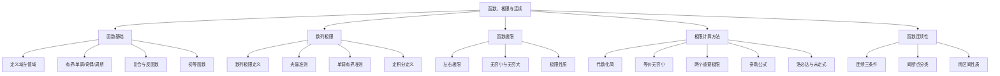
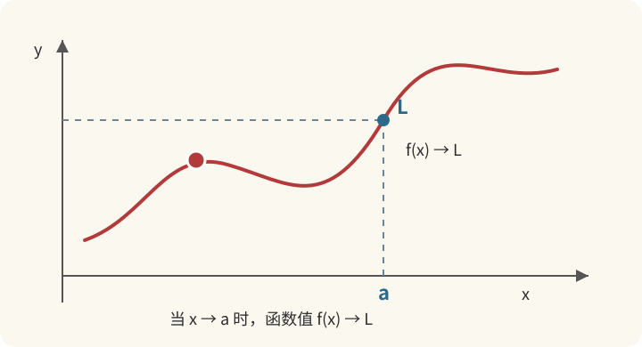
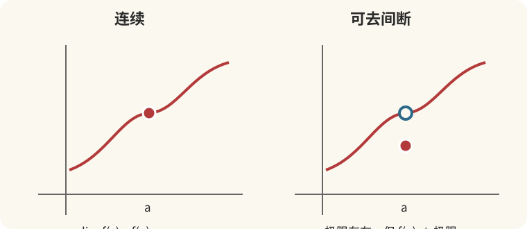

# 第1章 函数、极限与连续

> **样张说明**：本文件用于展示正式讲义的写作风格、图文比例和知识点讲解方式。正式版本将在此基础上继续补充全部考纲内容、练习和审核记录。

## 建议阅读顺序

**这章怎么读**

第一遍：先读函数、极限和连续性，把“输入—附近趋势—点值”连起来。第二遍：练直接代入、化简、重要极限、等价无穷小与夹逼。泰勒、洛必达和定积分方法需要后续知识，可以学到对应章节后再回看。

每道例题都试着回答：题目问什么？为什么选这个方法？这一步用了什么条件？最后到“动手练习”独立做一遍。

## 本章导读

很多同学第一次学习高等数学时，会觉得“极限”特别抽象：函数明明在某一点没有定义，为什么还可以讨论它在这一点附近的表现？为什么有些题目要用等价无穷小，有些题目却要用洛必达法则？为什么 \(n\) 项和的极限，直接求和往往算不出来？

本章要解决的，正是这条主线：

```text
函数：研究量与量之间的对应关系
  ↓
极限：研究变量逐渐靠近某个位置时的变化趋势
  ↓
连续：研究这种变化是否平稳、是否出现断裂
```

后面的一元微分学和积分学，都是建立在本章之上的。因此，本章不建议只背公式。更重要的是理解：

- 函数研究的对象是什么；
- 极限研究的是“靠近过程”，不是简单代入；
- 连续性为什么是后续求导和积分的基础；
- 面对不同类型的极限，如何选择方法。

**数学二定位**：本章在数学二试卷中通常出现在选择、填空，也常与后续导数、积分结合出大题。对数学二来说，极限计算的熟练度直接决定后面做题速度；证明题虽然比重不如数学一，但闭区间零点、单调有界等结论仍会考。本章按“概念清楚 + 方法齐全 + 例题够练”的标准展开，目标是让你读完后可以少看甚至不看网课基础班。

---

## 本章知识地图



---

## 第一节 函数：先弄清楚“谁依赖谁”

### 从一个能算出来的问题开始

假设一本练习本卖3元，买 x 本要付 y 元，那么 y=3x。这里 x 是你决定的输入，y 是跟着变化的输出，乘以3就是对应规则。买2本付6元，买5本付15元：函数研究的就是这种“给定一个量，另一个量怎样确定”的关系。

这个例子还提醒我们：**公式之外，要看允许输入什么。**如果按整本出售，x 只能取0、1、2……；单看代数式 y=3x，实数都能代入，但负数本、半本不符合这个情境。实际问题的定义域，要同时考虑运算和实际含义。

接下来读到 f(x) 时，先在心里翻译成“规则 f 处理输入 x 后的结果”。f(2) 是把2代进去，**不是 f 乘以2**。例如 f(x)=x²+1，那么 f(2)=2²+1=5。

### 1.1 函数的直观含义

函数可以理解为一种“输入—输出规则”。给定一个允许的输入值，按照规则就能得到唯一的输出值。

例如：

$$
y=x^2
$$

当输入 \(x=2\) 时，输出唯一确定为 \(y=4\)；当输入 \(x=-2\) 时，输出仍然唯一确定为 \(y=4\)。

这里有两个要点：

1. 输入值必须属于允许的范围；
2. 每一个输入值只能对应一个输出值。

这就是函数定义中“定义域”和“唯一对应”的核心。

> 💡 **直观理解**
>
> 函数不要求不同的输入得到不同的输出，但要求同一个输入不能同时得到两个不同的输出。

把函数写成

$$
y=f(x),\quad x\in D
$$

时，\(D\) 是定义域；所有函数值 \(f(x)\) 组成的集合叫值域 \(f(D)\)。定义域决定“能不能代入”，值域决定“代入之后可能得到什么”。

### 定义域和值域：用同一个例子分清

设 f(x)=x²，并规定 −2≤x≤1。允许输入的数是整个区间 [−2,1]，这就是定义域。把这些数平方，最小能得到0，最大能得到4，而且中间的每个值都能取到，所以值域是 [0,4]。

为什么不是 [1,4]？因为不能只把两个端点平方。输入0也被允许，而 f(0)=0。**找值域，要看整个输入范围内的输出，不能只看端点。**

另一个容易混淆的问题是 y²=x。给 x=4，会出现 y=2 和 y=−2，所以它没有直接确定“y 是 x 的函数”。加上 y≥0 的限制，选定 y=√x 后，每个允许的 x 才有唯一输出。

### 1.2 定义域：函数能够接受哪些输入

求函数定义域时，可以把它看成一份“使用说明书”：哪些输入会导致运算没有意义，就必须排除。

常见限制包括：

| 表达式 | 必须满足的条件 |
|---|---|
| 分式 \(\dfrac{1}{g(x)}\) | \(g(x)\neq 0\) |
| 偶次根式 \(\sqrt{g(x)}\) | \(g(x)\geq 0\) |
| 对数 \(\ln g(x)\) | \(g(x)>0\) |
| 反三角函数 \(\arcsin g(x)\) | \(-1\leq g(x)\leq 1\) |
| \(\tan x\) | \(x\neq \dfrac{\pi}{2}+k\pi\) |
| \(\cot x\) | \(x\neq k\pi\) |

求定义域时，最后要取所有条件的交集，而不是分别写出条件后就结束。

#### 例题 1.1：定义域的交集

求函数

$$
f(x)=\frac{\sqrt{2-x}}{\ln(x-1)}
$$

的定义域。

**解题思路**：分子和分母分别提出限制条件。

1. 根式有意义：

   $$
   2-x\geq 0\quad\Longrightarrow\quad x\leq 2
   $$

2. 对数有意义：

   $$
   x-1>0\quad\Longrightarrow\quad x>1
   $$

3. 分母不能为零：

   $$
   \ln(x-1)\neq 0
   $$

   因为 \(\ln 1=0\)，所以 \(x-1\neq 1\)，即 \(x\neq 2\)。

综合得到：

$$
1<x\leq 2,\qquad x\neq 2
$$

因此定义域为：

$$
(1,2)
$$

> ⚠️ **容易出错**
>
> 只写 \(x>1\) 和 \(x\leq 2\) 还不够。因为 \(x=2\) 时，\(\ln(x-1)=\ln 1=0\)，分母为零，必须排除。

#### 例题 1.2：复合函数的定义域

设 \(f(x)=\sqrt{x}\)，\(g(x)=x^2-1\)，求 \(f(g(x))\) 与 \(g(f(x))\) 的定义域。

**解**：

1. \(f(g(x))=\sqrt{x^2-1}\)，要求 \(x^2-1\geq 0\)，即 \(|x|\geq 1\)，定义域为 \((-\infty,-1]\cup[1,+\infty)\)。

2. \(g(f(x))=(\sqrt{x})^2-1=x-1\)，但内层 \(\sqrt{x}\) 要求 \(x\geq 0\)，所以定义域为 \([0,+\infty)\)，**不能**只看化简后的 \(x-1\)。

> 📌 **方法总结**
>
> 复合函数定义域 = 先保证内层有意义，再保证内层的输出落在外层定义域内。化简后再求定义域，往往会把限制条件丢掉。

### 回头看定义域题：每一步到底在排除什么

求定义域就像过几道关卡：过了根式这一关，还要过对数这一关，最后还要过分母这一关。交集的意思是“每一关都通过”，并集则是“过一关就算”，显然后者不够。

上面的 √(2−x)/ln(x−1)，可以用几个点核对：x=1 时对数的真数为0、没有意义；x=1.5 时三项要求都满足；x=2 时分母为0。这样可以检查答案 (1,2) 的两个端点为什么都不取。代点是核对，完整答案仍由不等式求交集得到。

复合函数也按“过关”的顺序看。算 g(f(x)) 要先算 f(x)，再把结果交给 g。即使最后化简成 x−1，也不能让最开始无法通过 √x 的负数输入重新进来。

### 1.3 函数的常见性质

函数的性质不是孤立的记忆点，它们会在后面的极限、导数和作图中反复出现。

| 性质 | 含义 | 判断时先看什么 |
|---|---|---|
| 有界性 | 函数值不会超过某个固定范围 | 是否存在 \(M>0\) 使 \(\lvert f(x)\rvert\leq M\) |
| 单调性 | 自变量增大时，函数值整体增大或减小 | 比较 \(x_1<x_2\) 时的函数值 |
| 奇偶性 | 图像关于原点或纵轴对称 | **定义域是否关于原点对称** |
| 周期性 | 图像按固定长度重复 | 是否存在 \(T>0\) 使 \(f(x+T)=f(x)\) |

#### 有界性

若存在 \(M>0\)，使得对一切 \(x\in D\) 都有 \(\lvert f(x)\rvert\leq M\)，则称 \(f\) 在 \(D\) 上有界。若对任意 \(M>0\)，总能找到 \(x\) 使 \(\lvert f(x)\rvert>M\)，则无界。

例如 \(\sin x\) 在 \(\mathbb{R}\) 上有界；\(\dfrac{1}{x}\) 在 \((0,1)\) 上无界，在 \([1,+\infty)\) 上有界。**有界性必须指明区间**，离开区间谈“有没有界”没有意义。

#### 单调性

在区间 \(I\) 上，若 \(x_1<x_2\) 时总有 \(f(x_1)<f(x_2)\)（或 \(\leq\)），则称 \(f\) 在 \(I\) 上单调增加（或单调不减）。中学用定义比较，考研以后主要用导数符号判断，但定义仍是本质。

#### 奇偶性

判断奇偶性时，**第一步永远是检查定义域**。比如 \(\ln x\) 的定义域是 \((0,+\infty)\)，不关于原点对称，因此它既不是奇函数，也不是偶函数；不能只代入 \(f(-x)\) 进行形式计算。

常见结论：

- 偶函数：\(f(-x)=f(x)\)，图像关于 \(y\) 轴对称，如 \(x^2\)，\(\cos x\)，\(\lvert x\rvert\)；
- 奇函数：\(f(-x)=-f(x)\)，图像关于原点对称，如 \(x^3\)，\(\sin x\)，\(\tan x\)；
- 奇函数若在 \(x=0\) 有定义，则 \(f(0)=0\)。

#### 周期性

若存在 \(T>0\)，使对一切 \(x\in D\) 有 \(x+T\in D\) 且 \(f(x+T)=f(x)\)，则 \(f\) 为周期函数。三角函数是最典型的一类：\(\sin x\)、\(\cos x\) 的周期是 \(2\pi\)，\(\tan x\) 的周期是 \(\pi\)。

### 这些性质分别在问什么

**有界性问“能不能给所有输出套上一个固定范围”。**sin x 始终在 −1 与1之间，因此有界。1/x 在 (0,1) 上却可以取到10、100、1000……，你给出多大的上限，都能用更小的正数 x 超过它。

**单调性问“输入往右走，输出是否一直朝同一方向变化”。**x² 在 [0,+∞) 上递增，但在整个实数范围上并不递增：从 −2 到 −1，输出从4降到1；从1到2，输出又从1升到4。判断时一定说清区间。

**奇偶性问“相反的两个输入，输出有什么关系”。**x² 在2与−2处都输出4，是偶函数；x³ 在2与−2处分别输出8与−8，是奇函数。若定义域只允许正数，另一边的输入根本不存在，就不能这样成对比较。

**周期性问“往右平移固定距离后，整套输出是否重复”。**sin(x+2π)=sin x，说明2π是一个周期；偶函数的左右对称并不等于周期重复，例如 x² 是偶函数，却不是周期函数。

### 1.4 复合函数与反函数

复合函数就是“先做一层运算，再把结果送入下一层”。若

$$
u=g(x),\quad y=f(u)
$$

那么复合后写成 \(y=f(g(x))\)。复合函数成立的关键是：内层函数的输出，必须落在外层函数的定义域内。

反函数则是把输入和输出的角色交换。若 \(y=f(x)\) 在相应区间上是严格单调的，则它是一一对应的，存在反函数 \(x=f^{-1}(y)\)，习惯写成 \(y=f^{-1}(x)\)。图像上，原函数与反函数关于直线 \(y=x\) 对称。

重要对应关系：

$$
D_f = R_{f^{-1}},\qquad R_f = D_{f^{-1}}
$$

> ⚠️ **表述提醒**
>
> “一一对应”是反函数存在的本质；“区间上严格单调”是常用充分条件；有水平段的单调不减函数不一定有反函数。不要把“必须单调”说成定义。

#### 例题 1.3：求反函数并确定其定义域

求 \(y=\dfrac{e^x-e^{-x}}{2}\) 的反函数。

**解**：记 \(y=\sinh x\)（双曲正弦）。由

$$
e^{2x}-2ye^x-1=0
$$

解得

$$
e^x=y+\sqrt{y^2+1}\quad(\text{因 }e^x>0)
$$

故

$$
x=\ln\left(y+\sqrt{y^2+1}\right)
$$

反函数为

$$
y=\ln\left(x+\sqrt{x^2+1}\right),\quad x\in\mathbb{R}
$$

原函数值域为 \(\mathbb{R}\)，这正是反函数的定义域。

### 反函数：能不能根据结果找回输入

#### 入门例题　把每一步运算倒过来

设 f(x)=2x+3。正着算是“乘2，再加3”；倒着算就应当“减3，再除以2”。从 y=2x+3 解出 x=(y−3)/2，再把表示输入的字母改写为 x，得到 f⁻¹(x)=(x−3)/2。

核对一下：f(4)=11，反函数把11送回4，因为 (11−3)/2=4。这里 f⁻¹ 表示反函数，**不是倒数 1/f(x)**。

为什么 x² 在整个实数范围上没有反函数？因为看到输出4，无法知道原来的输入是2还是−2。把原函数的定义域限制为 [0,+∞)，才可以用 √x 唯一找回输入。

### 1.5 初等函数

**基本初等函数**包括：幂函数、指数函数、对数函数、三角函数、反三角函数。由常数和基本初等函数经过有限次四则运算与复合所得到、并能用一个式子表示的函数，称为**初等函数**。

考研中几乎默认：

> 初等函数在其定义区间内连续。

这条结论可以省去大量“验证连续”的步骤：只有在分界点、无定义点、人为定义的分段点，才必须回到连续定义去检查。

---

## 第二节 极限：研究“靠近时发生什么”

### 先看数字怎样变化，再读极限符号

先把 aₙ=1/n 的前几项写出来：1、1/2、1/3、1/4……。下标 n 表示“第几项”，aₙ 表示“这一项的数值”。当 n 越来越大，1/n 会越来越小。

| 第几项 n | 数值 1/n | 离0的距离 |
| --- | --- | --- |
| 10 | 0.1 | 0.1 |
| 100 | 0.01 | 0.01 |
| 1000 | 0.001 | 0.001 |

如果要求误差小于0.01，选 n>100 就够了；要求小于0.0001，选 n>10000 就够了。无论把误差要求提得多严格，都能从某一项起，让**后面的每一项**满足要求。这才是极限为0的含义。

注意两个词：“从某项起”和“每一项”。偶尔靠近0还不够。例如 0、1、0、1……，虽然反复出现0，却总会回到1，因此不收敛。极限也不要求最后真的等于目标，1/n 的每一项都大于0，极限仍然是0。

下面的 ε 只是“允许误差”的名字，N 是“从哪里开始能保证合格”的门槛。先读懂上面的数字例子，再看符号就不必硬背。

### 2.1 数列极限：先把 \(n\) 看清

数列可以看成定义在正整数集上的函数 \(a_n=f(n)\)。数列极限研究的是：当下标 \(n\) 无限增大时，\(a_n\) 是否无限接近某个固定数 \(A\)。

记作

$$
\lim_{n\to\infty}a_n=A
$$

直观上：对任意小的误差范围，只要 \(n\) 足够大，\(a_n\) 就能落在这个误差范围内。严格的 \(\varepsilon-N\) 语言是：

$$
\forall \varepsilon>0,\ \exists N\in\mathbb{N},\ \text{当 }n>N\text{ 时，有 }\lvert a_n-A\rvert<\varepsilon
$$

数学二对 \(\varepsilon-N\)、\(\varepsilon-\delta\) 的**严格证明要求有限**，主要用于理解“无限接近”的含义；计算题主要靠后面的方法。

几个常见事实：

- 收敛数列的极限唯一；
- 收敛数列必有界；**有界不一定收敛**（如 \((-1)^n\)）；
- 收敛数列的保号性：若 \(\lim a_n=A>0\)，则当 \(n\) 充分大时 \(a_n>0\)。

#### 例题 1.4：用定义理解 \(\lim\dfrac{1}{n}=0\)

对任意 \(\varepsilon>0\)，取 \(N=\left\lfloor\dfrac{1}{\varepsilon}\right\rfloor\)，则当 \(n>N\) 时

$$
\left\lvert\frac{1}{n}-0\right\rvert=\frac{1}{n}<\varepsilon
$$

这说明“接近”是可以通过增大 \(n\) 来控制的，并不要求 \(1/n\) 等于 \(0\)。

### 2.2 函数极限：不是简单代入

考虑函数：

$$
f(x)=\frac{x^2-1}{x-1}
$$

当 \(x\neq1\) 时，可以约去因子：

$$
f(x)=x+1
$$

但原函数在 \(x=1\) 处没有定义。

这时虽然不能说 \(f(1)=2\)，但可以观察 \(x\) 从 \(1\) 的左边或右边逐渐接近 \(1\) 时，\(f(x)\) 会逐渐接近 \(2\)。

这就是：

$$
\lim_{x\to1}\frac{x^2-1}{x-1}=2
$$

注意，极限描述的是“\(x\) 接近某点时”的趋势，不要求函数在该点一定有定义。



图中红色曲线上的运动点表示：\(x\) 正在接近 \(a\)，对应的函数值正在接近 \(L\)。图中的动画在支持SVG动画的浏览器中会自动播放；即使不播放，静态图也保留了完整含义。

用 \(\varepsilon-\delta\) 语言，\(\displaystyle\lim_{x\to a}f(x)=A\) 的含义是：

$$
\forall \varepsilon>0,\ \exists \delta>0,\ \text{当 }0<\lvert x-a\rvert<\delta\text{ 时，有 }\lvert f(x)-A\rvert<\varepsilon
$$

注意 \(0<\lvert x-a\rvert\)：讨论极限时故意排除 \(x=a\) 本身。这正是“极限存在”和“函数在该点连续”不能混为一谈的原因。

还有一类 \(x\to\infty\) 的极限：

$$
\lim_{x\to\infty}f(x)=A
$$

表示 \(\lvert x\rvert\) 充分大时，\(f(x)\) 无限接近 \(A\)。计算时可与数列极限类比。

### 为什么没有 f(1)，却能算 x→1 的极限

| 靠近方向 | x 的取值 | (x²−1)/(x−1) |
| --- | --- | --- |
| 从左侧 | 0.9；0.99；0.999 | 1.9；1.99；1.999 |
| 从右侧 | 1.1；1.01；1.001 | 2.1；2.01；2.001 |
| 恰好在目标点 | 1 | 原式无定义 |

表格帮助我们猜到目标是2，但有限几个数不能代替证明。真正的理由是：只要 x≠1，原式就等于 x+1，于是输出与2的距离恰好等于输入与1的距离：

|f(x)−2|=|(x+1)−2|=|x−1|，x≠1

想让输出离2不到0.001，就让输入离1不到0.001，并且不取1本身。所以此题可以直接取 δ=ε。δ 控制输入距离，ε 控制输出误差。

如果单独补上 f(1)=100，附近的输出仍趋于2，极限仍是2。**目标点的函数值回答“到站后在哪儿”，极限回答“沿路正在靠近哪儿”。**两者能不能接上，是后面连续性要检查的问题。

### 2.3 左极限和右极限

从左侧接近 \(a\)，记作：

$$
\lim_{x\to a^-}f(x)
$$

从右侧接近 \(a\)，记作：

$$
\lim_{x\to a^+}f(x)
$$

只有当左右极限都存在且相等时，双侧极限才存在：

$$
\lim_{x\to a}f(x)=L
\iff
\lim_{x\to a^-}f(x)=\lim_{x\to a^+}f(x)=L
$$

> 📌 **一句话记忆**
>
> 双侧极限存在，首先要“左右都存在”，其次要“左右相等”。

**必须优先检查左右极限的场合**：

1. 分段函数的分界点；
2. 含 \(\lvert x-a\rvert\) 的函数；
3. \(e^{1/x}\)、\(\arctan\dfrac{1}{x}\)、\(\dfrac{1}{x}\) 在 \(x=0\) 附近；
4. \(x\to\infty\) 时的 \(\arctan x\)、\(e^x\) 等。

#### 例题 1.5：分段函数的极限

设

$$
f(x)=
\begin{cases}
x+1,&x<1,\\
2x-1,&x\geq1.
\end{cases}
$$

求 \(\displaystyle\lim_{x\to1}f(x)\)。

**解**：

左极限使用 \(x<1\) 时的表达式：

$$
\lim_{x\to1^-}f(x)=\lim_{x\to1^-}(x+1)=2
$$

右极限使用 \(x\geq1\) 时的表达式：

$$
\lim_{x\to1^+}f(x)=\lim_{x\to1^+}(2x-1)=1
$$

左右极限不相等，因此：

$$
\lim_{x\to1}f(x)\text{ 不存在}
$$

这里不能直接把 \(x=1\) 代入某一段表达式，因为双侧极限需要同时检查左右两侧。

#### 例题 1.6：经典左右极限

求 \(\displaystyle\lim_{x\to0}e^{1/x}\)。

**解**：

- \(x\to0^+\) 时，\(\dfrac{1}{x}\to+\infty\)，故 \(e^{1/x}\to+\infty\)；
- \(x\to0^-\) 时，\(\dfrac{1}{x}\to-\infty\)，故 \(e^{1/x}\to0\)。

左右不一致，双侧极限不存在。同理 \(\displaystyle\lim_{x\to0}\arctan\dfrac{1}{x}\) 也不存在（左为 \(-\dfrac{\pi}{2}\)，右为 \(\dfrac{\pi}{2}\)）。

### 分段函数：先确定站在哪一侧，再选择公式

求 x→1⁻ 的极限时，可以想一个略小于1的数，例如0.99。它落在 x<1 这一段，所以用 x+1。求 x→1⁺ 时，想1.01，它落在另一段，所以用 2x−1。**分界点上的等号决定 f(1)，不能代替附近左右两边的判断。**

#### 入门例题　绝对值也藏着两段规则

求 x→0 时 |x|/x 的极限。先按正负去掉绝对值：x>0 时 |x|=x，所以比值是1；x<0 时 |x|=−x，所以比值是−1。

因此右极限为1，左极限为−1，双侧极限不存在。把 x=0 代进去得到 0/0，只能提醒我们需要进一步分析，不能直接用它宣布“没有极限”。

### 2.4 无穷小与无穷大

在某个变化过程中，极限为 \(0\) 的变量叫**无穷小**；绝对值无限增大的变量叫**无穷大**。它们描述的是变化趋势，不是某个“特别小”或“特别大”的固定数。

例如，当 \(x\to0\) 时，\(x\)、\(\sin x\) 和 \(1-\cos x\) 都是无穷小；当 \(x\to\infty\) 时，\(x\) 是无穷大，而 \(1/x\) 是无穷小。

**无穷小的运算**：

- 有限个无穷小之和仍是无穷小；
- 有界量乘无穷小仍是无穷小；
- **无穷多个无穷小之和不一定是无穷小**（这是 \(n\) 项和数列极限的核心难点）。

**无穷小与极限的关系**：

$$
\lim f(x)=A\iff f(x)=A+\alpha(x),\quad \alpha(x)\to0
$$

这条等价关系在证明和“已知极限反推函数”时非常有用。

#### 无穷小的阶

设 \(\alpha\to0\)，\(\beta\to0\)。

| 关系 | 记号 / 含义 |
|---|---|
| \(\beta=o(\alpha)\) | \(\beta\) 是比 \(\alpha\) 高阶的无穷小（\(\beta/\alpha\to0\)） |
| \(\beta\sim\alpha\) | \(\beta\) 与 \(\alpha\) 等价（\(\beta/\alpha\to1\)） |
| \(\beta=O(\alpha)\) | \(\beta\) 是 \(\alpha\) 同阶或高阶的无穷小 |
| \(\beta/\alpha^k\to c\neq0\) | \(\beta\) 是 \(\alpha\) 的 \(k\) 阶无穷小 |

比较无穷小的阶，实际上是在比较它们趋近于 \(0\) 的速度。阶数越高，趋近 \(0\) 越快。

#### 无穷大

若 \(\lvert f(x)\rvert\) 在变化过程中无限增大，记 \(f(x)\to\infty\)。注意：

- 无穷大一定无界，但**无界不一定趋于无穷大**（如 \(x\sin x\) 在 \(x\to\infty\) 时无界，但不趋于无穷）；
- 无穷大与无穷小的倒数关系：若 \(f(x)\to\infty\)，则 \(\dfrac{1}{f(x)}\to0\)（在 \(f(x)\neq0\) 的前提下）。

### “高阶”为什么反而更小

当 x→0 时，对比 x 和 x²。取 x=0.1，分别是0.1和0.01；取 x=0.01，分别是0.01和0.0001。x² 比 x 缩得更快，用比值看就是 x²/x=x→0，所以 x² 是比 x 高阶的无穷小。“高阶”说的是幂次或阶的关系，不是数值更大。

再比较 x+x² 与 x：比值 (x+x²)/x=1+x→1，所以二者等价。但它们相减恰好留下 x²。若在差式中把 x+x² 换成 x，留下的 x² 就被你抹掉了。后面“等价无穷小不能随意用于加减”，原因就在这里。

还要说清变化过程：固定数0.000001虽然很小，却不会继续靠近0，所以它本身不是这个意义上的无穷小。每项都很小也不保证总和小：n 个 1/n 相加始终等于1。项数跟着 n 变多时，不能直接套用“有限个无穷小相加”的结论。

### 2.5 极限的性质

这些性质在选择题和证明题中经常直接使用。

1. **唯一性**：若极限存在，则必唯一。

2. **有界性（局部）**：若 \(\displaystyle\lim_{x\to a}f(x)\) 存在，则存在 \(a\) 的某个去心邻域，使 \(f\) 在该邻域内有界。收敛数列必有界。

3. **保号性**：
   - 若 \(\displaystyle\lim_{x\to a}f(x)=A>0\)，则在 \(a\) 的某去心邻域内 \(f(x)>0\)；
   - 反过来，若在 \(a\) 的某去心邻域内 \(f(x)\geq 0\)，且极限存在，则 \(A\geq 0\)。

   > 注意反向结论中是“\(\geq\)”而不是“\(>\)”：由 \(f(x)>0\) 只能得到 \(A\geq 0\)，极限可能为 \(0\)。

4. **夹逼性**：见第三节计算方法。

5. **四则运算**（在相应极限都存在的前提下）：

$$
\lim(f\pm g)=\lim f\pm\lim g,\quad
\lim(fg)=\lim f\cdot\lim g,\quad
\lim\frac{f}{g}=\frac{\lim f}{\lim g}\ ( \lim g\neq0)
$$

> ⚠️ **典型错误**
>
> 四则运算要求每个参与的极限**分别存在**。若 \(\lim f\) 或 \(\lim g\) 不存在，不能拆开，更不能写成“不存在 \(\pm\) 不存在 \(=\) 不存在”。例如 \(f(x)=\sin\dfrac1x\)，\(g(x)=-\sin\dfrac1x\)，两者在 \(x\to0\) 时都无极限，但 \(f+g\equiv0\) 极限为 \(0\)。

---

## 第三节 极限的计算方法

面对极限题，建议按照以下顺序判断：

```text
先尝试直接代入
      ↓
出现 0/0 或 ∞/∞ 等未定式？
      ↓
能否因式分解、约分或有理化？
      ↓
能否使用等价无穷小？
      ↓
能否使用两个重要极限（尤其 1^∞）？
      ↓
是否适合泰勒展开（加减结构、高阶项）？
      ↓
数列：夹逼 / 单调有界 / 定积分定义
      ↓
最后考虑洛必达或其他方法
```

### 先分清：0/0 是题目的状态，不是答案

下面三题在 x→0 时，分子分母都趋于0，结果却不同：x/x=1；x²/x=x→0；x/x²=1/x，左右分别趋于相反的无穷，没有有限双侧极限。

所以“0/0 型”只表示：分子和分母都在缩小，**还不知道谁缩得更快**。我们需要约分、比较阶或使用定理，找出二者的相对变化。它不是一个合法的除法结果。

代入则有前提：例如 x²+1 在 x=2 连续，所以极限为5；分段函数在分界点即使能代入，也必须先看两侧。方法表只是判断线索，不能跳过适用条件。

### 3.1 直接代入

如果函数在所考察的点附近连续，并且代入后得到有意义的结果，可以直接代入。

例如：

$$
\lim_{x\to2}(x^2+3x-1)=2^2+3\times2-1=9
$$

多项式、\(e^x\)、\(\sin x\)、\(\cos x\)、\(\ln(1+x)\)（\(x\to0\)）等在定义范围内连续，均可直接代入。

### 3.2 因式分解、约分与有理化

#### 因式分解

$$
\lim_{x\to1}\frac{x^2-1}{x-1}
$$

直接代入得到 \(\dfrac00\)，但因式分解后：

$$
\frac{x^2-1}{x-1}=\frac{(x-1)(x+1)}{x-1}=x+1
$$

所以：

$$
\lim_{x\to1}\frac{x^2-1}{x-1}=2
$$

#### 有理化

当出现根号差或根号和时，乘以共轭：

$$
\sqrt{A}-\sqrt{B}=\frac{A-B}{\sqrt{A}+\sqrt{B}}
$$

#### 例题 1.7：有理化

求

$$
\lim_{x\to0}\frac{\sqrt{1+x}-\sqrt{1-x}}{x}
$$

**解**：分子有理化，

$$
\frac{\sqrt{1+x}-\sqrt{1-x}}{x}
=\frac{(1+x)-(1-x)}{x(\sqrt{1+x}+\sqrt{1-x})}
=\frac{2}{\sqrt{1+x}+\sqrt{1-x}}
$$

代入 \(x=0\) 得

$$
\lim_{x\to0}\frac{\sqrt{1+x}-\sqrt{1-x}}{x}=1
$$

（也可以用等价无穷小或泰勒：分子 \(\sim \dfrac{x}{2}-\left(-\dfrac{x}{2}\right)=x\)。）

### 3.3 等价无穷小

当 \(x\to0\) 时，常用等价无穷小如下（务必记熟，这是极限计算的“第一工具箱”）：

| 等价关系 | 条件 |
|---|---|
| \(\sin x\sim x\) | \(x\to0\) |
| \(\tan x\sim x\) | \(x\to0\) |
| \(\arcsin x\sim x\) | \(x\to0\) |
| \(\arctan x\sim x\) | \(x\to0\) |
| \(1-\cos x\sim\dfrac{x^2}{2}\) | \(x\to0\) |
| \(\ln(1+x)\sim x\) | \(x\to-1\) 且 \(x\to0\) |
| \(e^x-1\sim x\) | \(x\to0\) |
| \(a^x-1\sim x\ln a\) | \(x\to0,\ a>0,\ a\neq1\) |
| \((1+x)^\alpha-1\sim\alpha x\) | \(x\to0\) |
| \(\log_a(1+x)\sim\dfrac{x}{\ln a}\) | \(x\to0,\ a>0,\ a\neq1\) |
| \(x-\sin x\sim\dfrac{x^3}{6}\) | \(x\to0\) |
| \(\tan x-x\sim\dfrac{x^3}{3}\) | \(x\to0\) |
| \(e^x-1-x\sim\dfrac{x^2}{2}\) | \(x\to0\) |
| \(\ln(1+x)-x\sim-\dfrac{x^2}{2}\) | \(x\to0\) |

符号“\(\sim\)”表示两个量的比值趋于 \(1\)。更一般地：若 \(\alpha\sim\tilde\alpha\)，\(\beta\sim\tilde\beta\)，则

$$
\lim\frac{\alpha}{\beta}=\lim\frac{\tilde\alpha}{\tilde\beta}
$$

**使用原则**：

- 等价无穷小主要用于**乘除因子**，在这些位置可以整体替换；
- 在**加减结构**中不能把其中一项单独替换成低阶等价，否则会破坏高阶项；
- 加减结构的正确做法是：先恒等变形、提取公因式，或使用泰勒展开到足够阶。

> ⚠️ **典型错误**
>
> \(\sin x\sim x\)，并不意味着在任意加法式中都可以把 \(\sin x\) 无条件替换成 \(x\)。例如
> \(\tan x-\sin x\)，若两项都换成 \(x\)，会错误地得到 \(0\)。

#### 例题 1.8：先化简，再使用等价无穷小

求

$$
\lim_{x\to0}\frac{\tan x-\sin x}{x^3}
$$

**解**：不能把分子中的 \(\tan x\) 和 \(\sin x\) 都直接替换成 \(x\)。先利用恒等式：

$$
\tan x-\sin x=\sin x\left(\frac{1}{\cos x}-1\right)=\frac{\sin x(1-\cos x)}{\cos x}
$$

再使用 \(\sin x\sim x\)，\(1-\cos x\sim\dfrac{x^2}{2}\)，\(\cos x\to1\)：

$$
\frac{\tan x-\sin x}{x^3}\sim\frac{x\cdot\frac{x^2}{2}}{1\cdot x^3}=\frac12
$$

所以极限为 \(\dfrac12\)。

#### 例题 1.9：乘除结构直接替换

求

$$
\lim_{x\to0}\frac{\ln(1+2x)}{\sin 3x}
$$

**解**：分子分母都是乘除位置中的因子，

$$
\ln(1+2x)\sim 2x,\qquad \sin 3x\sim 3x
$$

故

$$
\lim_{x\to0}\frac{\ln(1+2x)}{\sin 3x}=\lim_{x\to0}\frac{2x}{3x}=\frac23
$$

### 有理化为什么能把根号差算下去

上面的根号题，直接代入是0/0。看到两个根号相减，可以想到平方差：(A−B)(A+B)=A²−B²。把分子分母同时乘以 √(1+x)+√(1−x)，相当于乘了一个值为1的分式，原式没有变。

[√(1+x)−√(1−x)]/x = [(1+x)−(1−x)] / {x[√(1+x)+√(1−x)]}

现在分子变成2x。极限考察 x≠0 的附近，可以约去 x，得到 2/[√(1+x)+√(1−x)]。这时分母趋于2，不再是0，才可以直接代入，结果是1。

**回顾选择理由：**根号差 → 想平方差 → 乘共轭式 → 消去造成0/0的因子 → 再代入。以后换成 √(1+2x)−1，也可以沿着这条思路走。

三角函数极限中的角度一律按**弧度制**理解。sin x/x→1 的公式不能把“度数”直接当成 x 代入。

### 3.4 两个重要极限与 \(1^\infty\)

#### 第一个重要极限

$$
\lim_{x\to0}\frac{\sin x}{x}=1
$$

核心用途是把含有 \(\sin u\) 的表达式改造成 \(\dfrac{\sin u}{u}\)，其中 \(u\to0\)。

$$
\lim_{x\to0}\frac{\sin 3x}{x}
=\lim_{x\to0}\frac{\sin 3x}{3x}\cdot 3=3
$$

#### 第二个重要极限

最常用形式：

$$
\lim_{x\to\infty}\left(1+\frac1x\right)^x=e
\qquad\Longleftrightarrow\qquad
\lim_{x\to0}(1+x)^{1/x}=e
$$

更一般地，若 \(\alpha(x)\to0\)，则

$$
(1+\alpha(x))^{1/\alpha(x)}\to e
$$

当底数趋近 \(1\)、指数趋向无穷时，不能直接把结果写成 \(1\)；需要把它变形上面的结构。

### 底数接近1，为什么结果不一定是1

看 (1+1/n)ⁿ：n=1 时是2，n=10 时约为2.594，n=100 时约为2.705。每次乘的数在靠近1，但相乘次数也在增加，这两种变化共同决定结果，最终趋于 e≈2.71828。

求 (1+3x)^(1/x) 的极限时，令 t=3x。底数变成1+t，指数 1/x=3/t。于是原式等于 [(1+t)^(1/t)]³，方括号内趋于 e，所以答案是 e³。这里的3不是凭记忆补上的，而是换元后指数带来的。

下面的快捷写法把这个过程概括了起来。使用时，底数在所讨论的附近要为正，且指数中的 v(u−1) 要有极限；否则不能把一个还没有求出的极限当成已知常数。

#### \(1^\infty\) 型未定式：三行式

设 \(\lim u(x)=1\)，\(\lim v(x)=\infty\)，则

$$
\lim u^{v}=\lim e^{v\ln u}=e^{\lim v\ln u}
$$

又因为 \(u\to1\) 时 \(\ln u\sim u-1\)，所以

$$
\boxed{\ \lim u^{v}=e^{\lim v(u-1)}\ }
$$

这个公式叫“三行式”或“\(1^\infty\) 快捷公式”，必须掌握。

#### 例题 1.10：\(1^\infty\) 标准题

求

$$
\lim_{x\to0}(1+3x)^{1/x}
$$

**解法一（凑定义）**：

$$
(1+3x)^{1/x}=\left[(1+3x)^{1/(3x)}\right]^3\to e^3
$$

**解法二（三行式）**：

$$
v(u-1)=\frac1x\cdot 3x=3,\quad\text{故极限为 }e^3
$$

#### 例题 1.11：更一般的 \(1^\infty\)

求

$$
\lim_{x\to\infty}\left(\frac{x+1}{x-1}\right)^{2x}
$$

**解**：

$$
\frac{x+1}{x-1}=1+\frac{2}{x-1}
$$

于是

$$
v(u-1)=2x\cdot\frac{2}{x-1}\to 4
$$

极限为 \(e^4\)。

### 等价替换：先练“整个因子”，再处理差

以 ln(1+2x)/sin(3x) 为例，不要只背一个2/3。因为 2x→0，ln(1+2x)/(2x)→1；因为 3x→0，sin(3x)/(3x)→1。把原式拆成：

[ln(1+2x)/(2x)] × [(3x)/sin(3x)] × (2/3) → 1×1×(2/3)

这解释了为什么分子整体可以换成2x、分母整体可以换成3x：两个被省去的比值都趋于1，不影响最后的结果。ln(1+2x) 的“内部小量”是2x，不能漏掉系数2。

再回头看 tan x−sin x。两个单项都约等于 x，却不能说它们的差约等于0；要先化成 sin x(1−cos x)/cos x，再替换整个乘法因子。**差里有抵消，抵消后剩下什么才决定答案。**

公式表中的 a 是常数，需 a>0 且 a≠1；(1+x)^α−1~αx 这一条需固定的 α≠0。α=0 时原式恒为0，不能再用“比值趋于1”描述两个恒零量。

### 进阶方法的起点：先弄清“保留到几阶”

如果还没学导数，可以先把本段作为预习，先完成化简、重要极限和等价无穷小的基础题。泰勒公式的严格推导依赖后面的导数知识。这里先解释它为什么能处理抵消。

#### 入门例题　为什么只写 eˣ≈1+x 还不够

求 x→0 时 (eˣ−1−x)/x² 的极限。分子会减掉常数项1和一次项 x，所以只写 eˣ≈1+x，会把剩下的有效信息全部丢掉。需要多保留一项：

eˣ=1+x+x²/2+o(x²)

其中 o(x²) 的意思是：这部分余项除以 x² 后趋于0。代回原式，1与1抵消、x与x抵消，剩下 [x²/2+o(x²)]/x²=1/2+o(x²)/x²→1/2。

为什么这次保留到二阶就够？因为分母是 x²，我们要找出分子除以 x² 后仍会留下的项。上面的常数项、一次项先抵消；二次项留下1/2；更小的余项趋于0。

带着这个思路再看下面的四阶例题：把 eᵗ 展开后令 t=−x²/2，t²/2 就是 x⁴/8。不要把“关于 t 的二阶”误当成“关于 x 的二阶”。

### 3.5 泰勒公式：加减结构与高阶项的利器

当极限中出现加减、需要保留高阶项时，泰勒展开（麦克劳林公式）通常比反复用洛必达更干净。\(x\to0\) 时常用展开（Peano 余项）：

$$
\begin{aligned}
e^x &= 1+x+\frac{x^2}{2}+\frac{x^3}{6}+o(x^3)\\
\sin x &= x-\frac{x^3}{6}+o(x^3)\\
\cos x &= 1-\frac{x^2}{2}+\frac{x^4}{24}+o(x^4)\\
\ln(1+x) &= x-\frac{x^2}{2}+\frac{x^3}{3}+o(x^3)\\
(1+x)^\alpha &= 1+\alpha x+\frac{\alpha(\alpha-1)}{2}x^2+o(x^2)\\
\tan x &= x+\frac{x^3}{3}+o(x^3)\\
\arcsin x &= x+\frac{x^3}{6}+o(x^3)\\
\arctan x &= x-\frac{x^3}{3}+o(x^3)
\end{aligned}
$$

**使用原则**：

1. 分母是 \(x^k\) 时，分子至少展开到 \(x^k\) 阶；
2. 展开阶数不够会丢掉真正起作用的项，阶数过高浪费计算；
3. 代入化简后，低于 \(k\) 阶的系数必须全部抵消，否则要检查是否算错或阶数选错。

#### 例题 1.12：泰勒处理差

求

$$
\lim_{x\to0}\frac{\cos x-e^{-x^2/2}}{x^4}
$$

**解**：

$$
\cos x=1-\frac{x^2}{2}+\frac{x^4}{24}+o(x^4)
$$

$$
e^{-x^2/2}=1+\left(-\frac{x^2}{2}\right)+\frac{1}{2}\left(-\frac{x^2}{2}\right)^2+o(x^4)
=1-\frac{x^2}{2}+\frac{x^4}{8}+o(x^4)
$$

相减：

$$
\cos x-e^{-x^2/2}=\left(\frac{1}{24}-\frac18\right)x^4+o(x^4)=-\frac{1}{12}x^4+o(x^4)
$$

故极限为 \(-\dfrac{1}{12}\)。

> 📌 **方法总结**
>
> 遇到“两个接近的函数作差，分母是较高次幂”，第一反应应是泰勒，而不是对两项分别用等价无穷小，也不是上来就洛必达。

### 3.6 洛必达法则与全部未定式

#### 洛必达法则

主要处理 \(\dfrac00\) 和 \(\dfrac{\infty}{\infty}\) 型未定式。使用前必须先确认：

1. 分子、分母都趋于 \(0\)，或都趋于 \(\infty\)；
2. 在去心邻域内可导，且分母导数不为 \(0\)；
3. \(\displaystyle\lim\frac{f'}{g'}\) 存在（或为 \(\infty\)）。

此时

$$
\lim\frac{f}{g}=\lim\frac{f'}{g'}
$$

正确的使用方式是：**先判型，再确认条件，最后分子分母分别求导**。如果因式分解或等价无穷小两三步就能解决，就没有必要使用洛必达。

#### 例题 1.13：标准 \(\dfrac00\)

求

$$
\lim_{x\to0}\frac{e^x-1-x}{x^2}
$$

**解法一（等价）**：\(e^x-1-x\sim\dfrac{x^2}{2}\)，极限为 \(\dfrac12\)。

**解法二（洛必达）**：满足 \(\dfrac00\)，

$$
\lim_{x\to0}\frac{e^x-1}{2x}\quad\left(\frac00\right)
=\lim_{x\to0}\frac{e^x}{2}=\frac12
$$

两种方法都对，等价/泰勒通常更快。

#### 其他未定式如何转化

| 类型 | 转化思路 |
|---|---|
| \(0\cdot\infty\) | 改写为 \(\dfrac{0}{1/\infty}=\dfrac00\) 或 \(\dfrac{\infty}{1/0}=\dfrac{\infty}{\infty}\) |
| \(\infty-\infty\) | 通分、有理化，化为分式 |
| \(1^\infty\) | 三行式 \(e^{\lim v(u-1)}\) 或取对数 |
| \(0^0\) | 取对数：\(e^{\lim v\ln u}\) |
| \(\infty^0\) | 取对数：\(e^{\lim v\ln u}\) |

#### 例题 1.14：\(\infty-\infty\)

求

$$
\lim_{x\to0}\left(\frac{1}{x}-\frac{1}{e^x-1}\right)
$$

**解**：通分，

$$
\frac{1}{x}-\frac{1}{e^x-1}
=\frac{e^x-1-x}{x(e^x-1)}
$$

当 \(x\to0\) 时 \(e^x-1\sim x\)，分子 \(e^x-1-x\sim\dfrac{x^2}{2}\)，故

$$
\lim_{x\to0}\frac{x^2/2}{x\cdot x}=\frac12
$$

### 洛必达不是“对整个分式求导”

洛必达比较的是 f′(x)/g′(x)，不是商的导数 [f′g−fg′]/g²。以 (eˣ−1−x)/x² 为例：先分别求导，得到 (eˣ−1)/(2x)；再检查仍是0/0，才继续分别求导，得到 eˣ/2→1/2。每用一次都要重新检查。

完整使用时，还要保证所考察方向上导数之比有有限或无穷极限，才能据此推出原式的极限。如果求导后的比值没有极限，只能说明这次用法无法得出结论，不能反推原式没有极限。还没学求导规则时，可以先学前面的泰勒结果或代数方法，学完导数再回看本段。

### 3.7 夹逼准则

#### 定理（函数形式）

若在 \(a\) 的某去心邻域内 \(g(x)\leq f(x)\leq h(x)\)，且

$$
\lim_{x\to a}g(x)=\lim_{x\to a}h(x)=A
$$

则 \(\displaystyle\lim_{x\to a}f(x)=A\)。

数列形式完全类似：\(b_n\leq a_n\leq c_n\)，且 \(b_n\to A\)，\(c_n\to A\)，则 \(a_n\to A\)。

夹逼准则是处理 **\(n\) 项和**、**带 \(\sin/\cos\) 的有界因式**、**根式** 的核心工具。

#### 例题 1.15：经典 \(n\) 项和

求

$$
\lim_{n\to\infty}\left(\frac{1}{\sqrt{n^2+1}}+\frac{1}{\sqrt{n^2+2}}+\cdots+\frac{1}{\sqrt{n^2+n}}\right)
$$

**解**：每一项满足

$$
\frac{1}{\sqrt{n^2+n}}\leq\frac{1}{\sqrt{n^2+k}}\leq\frac{1}{\sqrt{n^2+1}}
$$

共有 \(n\) 项，因此

$$
\frac{n}{\sqrt{n^2+n}}\leq\sum_{k=1}^{n}\frac{1}{\sqrt{n^2+k}}\leq\frac{n}{\sqrt{n^2+1}}
$$

而

$$
\frac{n}{\sqrt{n^2+n}}=\frac{1}{\sqrt{1+1/n}}\to1,\qquad
\frac{n}{\sqrt{n^2+1}}=\frac{1}{\sqrt{1+1/n^2}}\to1
$$

由夹逼得原式极限为 \(1\)。

#### 例题 1.16：有界因式

求

$$
\lim_{n\to\infty}\frac{\sin n}{n}
$$

**解**：\(\left\lvert\dfrac{\sin n}{n}\right\rvert\leq\dfrac{1}{n}\to0\)，由夹逼（或有界量乘无穷小）得极限为 \(0\)。

### 夹逼的两端为什么要趋于同一个数

知道某个数始终在0与2之间，并不能判断它最后去哪里；但如果上下边界一起收拢到1，中间的数就没有别的去处。夹逼准则要求“两端同一个极限”，正是在表达这种收拢。

在上面的 n 项和中，每个分母与 n 的比值都接近1，因此每一项大约是1/n，n 项相加应该接近1。这只是选方法的直觉；正式证明要找到统一的上下界，再把不等式相加。

n/√(n²+n)=1/√(1+1/n)→1；n/√(n²+1)=1/√(1+1/n²)→1

这样两端为什么趋于1就展开了。不要把求和号里的每一项先取极限再相加：这里项数 n 同时在增长，不是固定有限项的求和。

### 3.8 单调有界准则

#### 定理

单调有界数列必有极限：

- 单调增加且有上界 \(\Rightarrow\) 收敛；
- 单调减少且有下界 \(\Rightarrow\) 收敛。

常用于**递推定义的数列** \(a_{n+1}=f(a_n)\)。证明模板：

1. 用数学归纳法证有界；
2. 用递推关系证单调（作差 \(a_{n+1}-a_n\) 或作商 \(a_{n+1}/a_n\)）；
3. 设极限为 \(A\)，在递推式两边取极限，解出 \(A\)。

#### 例题 1.17：递推数列

设 \(a_1=\sqrt2\)，\(a_{n+1}=\sqrt{2+a_n}\)。证明 \(\{a_n\}\) 收敛，并求极限。

**解**：

**有界**：用归纳法。\(a_1=\sqrt2<2\)。若 \(a_n<2\)，则

$$
a_{n+1}=\sqrt{2+a_n}<\sqrt{4}=2
$$

故对一切 \(n\) 有 \(a_n<2\)。又显然 \(a_n>0\)。

**单调**：

$$
a_{n+1}-a_n=\sqrt{2+a_n}-a_n=\frac{2+a_n-a_n^2}{\sqrt{2+a_n}+a_n}
=\frac{(2-a_n)(1+a_n)}{\sqrt{2+a_n}+a_n}>0
$$

（因为 \(0<a_n<2\)），故 \(a_n\) 单调增加。

由单调有界准则，\(\lim a_n=A\) 存在。在 \(a_{n+1}=\sqrt{2+a_n}\) 两边取极限：

$$
A=\sqrt{2+A}\quad\Rightarrow\quad A^2-A-2=0
$$

解得 \(A=2\) 或 \(A=-1\)（舍去，因 \(a_n>0\)）。故

$$
\lim_{n\to\infty}a_n=2
$$

### 递推题：先证明会停稳，才有资格设极限

aₙ₊₁=√(2+aₙ) 表示“把上一项加2，再开根号，生成下一项”。从 a₁=√2 出发，前几项约为1.414、1.848、1.962，看起来在上升并接近2；计算几项帮助猜答案，但还不是证明。

**补全有界的归纳步骤：**第一项在0与2之间。假设某一项满足0<aₙ<2，则2<2+aₙ<4，开根号后仍有0<aₙ₊₁<2。所以所有项都小于2。

**补全单调的理由：**相邻两项都是正数，可以比较平方。aₙ₊₁²−aₙ²=2+aₙ−aₙ²=(2−aₙ)(1+aₙ)>0，所以后一项比前一项大。数列一直增加又不超过2，由单调有界准则才知道它收敛。

此时设极限为 A，平方根的连续性允许把递推式变成 A=√(2+A)。平方后 (A−2)(A+1)=0，候选是2和−1；因为数列为正且递增，A≥√2，故只能取2。

为什么不能一上来就写 A=√(2+A)？方程只能给出“如果收敛，可能是多少”，不能证明收敛。反例是 aₙ₊₁=−aₙ、a₁=1：形式上设极限会解得 A=0，实际数列在1和−1之间来回跳，根本不收敛。

### 3.9 定积分定义求极限

这是数学二**高频考点**：把 \(n\) 项和写成某个函数在 \([0,1]\) 上的定积分。

核心公式：

$$
\lim_{n\to\infty}\frac1n\sum_{k=1}^{n}f\!\left(\frac{k}{n}\right)=\int_0^1 f(x)\,dx
$$

更一般地：

$$
\lim_{n\to\infty}\frac{b-a}{n}\sum_{k=1}^{n}f\!\left(a+\frac{k(b-a)}{n}\right)=\int_a^b f(x)\,dx
$$

**识别特征**：和式中出现 \(\dfrac{k}{n}\) 的函数，且前面带有 \(\dfrac1n\)（或可提出 \(\dfrac1n\)）。

#### 例题 1.18：定积分定义

求

$$
\lim_{n\to\infty}\frac1n\left(\sin\frac{\pi}{n}+\sin\frac{2\pi}{n}+\cdots+\sin\frac{n\pi}{n}\right)
$$

**解**：写成

$$
\frac1n\sum_{k=1}^{n}\sin\frac{k\pi}{n}
$$

令 \(f(x)=\sin(\pi x)\)，则这是 \(\displaystyle\int_0^1\sin(\pi x)\,dx\) 的积分和。于是

$$
\int_0^1\sin(\pi x)\,dx
=\left.-\frac1\pi\cos(\pi x)\right|_0^1
=-\frac1\pi(-1-1)=\frac{2}{\pi}
$$

> 📌 **方法选择**
>
> - \(n\) 项和、各项“差不多大” \(\to\) 夹逼；
> - \(n\) 项和、形如 \(\dfrac1n\sum f(k/n)\) \(\to\) 定积分定义；
> - 递推数列 \(\to\) 单调有界；
> - 通项已知且可直接求和 \(\to\) 先求和再取极限。

### 定积分这一步，先把求和看成一排小矩形

这一方法需要后面定积分的知识；第一次学到这里，可以先理解结构，学完积分后再掌握计算。若 f 在 [0,1] 上连续，把这个区间均分为 n 份，每份宽1/n，在右端点 k/n 取高度 f(k/n)，小矩形面积就是 (1/n)f(k/n)。

Σ 的意思是把 k=1、2……n 对应的项全部加起来。因此 (1/n)Σf(k/n) 就是这排矩形的总面积（高度为负时按带符号面积计算）。区间越分越细，这个和就趋于定积分。

在 sin(πk/n) 那道题里，小矩形宽度是1/n，高度函数是 f(t)=sin(πt)，积分区间是 [0,1]。π 包含在高度函数里。若改用宽度 π/n 来理解，就要把和式外面补上1/π，积分区间相应改为 [0,π]；两种写法结果一致。

∫₀¹ sin(πt)dt = [−cos(πt)/π]₀¹ = 1/π−(−1/π)=2/π

做这类题，先标出三个东西：**每份宽多少、在哪个点取值、对应哪个区间**。确认函数在区间上连续等可积条件后，再把和式写成积分。

### 3.10 极限计算方法速查

| 题目特征 | 优先方法 |
|---|---|
| 代入得正常数 | 直接结束 |
| \(\dfrac00\)，分子可因式分解 | 约分 |
| 含根号差/和 | 有理化 |
| 乘除结构、多个无穷小因子 | 等价无穷小 |
| \(\sin u/u\) 结构 | 第一个重要极限 |
| \(1^\infty\) | 三行式或凑 \(e\) |
| 加减后除以高次幂 | 泰勒公式 |
| 递推数列 | 单调有界 |
| \(n\) 项和 | 夹逼或定积分定义 |
| 化简后仍为 \(\dfrac00/\dfrac{\infty}{\infty}\) | 洛必达（确认条件） |

---

## 第四节 连续性：函数有没有“断开”

### 4.1 连续的三个条件

函数 \(f(x)\) 在 \(x=a\) 处连续，需要同时满足：

1. \(f(a)\) 有定义；
2. \(\displaystyle\lim_{x\to a}f(x)\) 存在；
3. \(\displaystyle\lim_{x\to a}f(x)=f(a)\)。

可以把它记成：

```text
有函数值
有极限
极限等于函数值
```

三个条件缺一不可。



左图中，函数值、极限和图像上的点完全衔接；右图中，极限存在，但函数在 \(x=a\) 处的实际取值不同，因此不是连续点，而是可去间断点。

若 \(f\) 在区间 \(I\) 上每一点都连续，称 \(f\) 在 \(I\) 上连续。**初等函数在定义区间内连续**，因此只需单独检查：

- 无定义点；
- 分段函数的分界点；
- 人为修改过某点函数值的点。

### 连续三条件：把“附近的点”和“这个点”分开看

仍然用 x≠1 时 f(x)=x+1 这个例子，附近的函数值都趋于2。只改变 x=1 处的定义，会出现三种情况：

| 在 x=1 怎么定义 | 极限 | 是否连续 |
| --- | --- | --- |
| 不定义 f(1) | 2 | 不连续：少了这个点 |
| 定义 f(1)=100 | 2 | 不连续：这个点放错了高度 |
| 定义 f(1)=2 | 2 | 连续：这个点与附近趋势接上 |

前两种都只需补上或改动一个点，就能使函数连续，所以叫“可去”间断。若左边趋于2、右边趋于1，改动分界点的一个值不可能同时接住两边，这就是跳跃间断不能靠补一个点解决的原因。

判断左右极限时，下面所说的“存在”都指**存在有限极限**。趋于无穷表示数值没有有限的落点，在间断点分类中归入第二类。

### 4.2 间断点的判断与分类

判断一个点是否为间断点，建议按顺序检查：

1. 函数在该点是否有定义；
2. 左右极限是否存在；
3. 左右极限是否相等；
4. 极限是否等于函数值。

统一分类（建议按此记忆）：

| 类型 | 特征 | 典型表现 |
|---|---|---|
| **第一类：可去间断点** | 左右极限相等，但函数无定义或函数值不等于极限 | 图像上像少了一个点 |
| **第一类：跳跃间断点** | 左右极限都存在，但不相等 | 左右两段接不上 |
| **第二类：无穷间断点** | 至少一侧极限为 \(\infty\) | 如 \(1/x\) 在 \(0\) |
| **第二类：振荡间断点** | 至少一侧极限不存在且不为无穷 | 如 \(\sin(1/x)\) 在 \(0\) |

> 💡 **记忆**
>
> 第一类 = 左右极限都存在；  
> 第二类 = 至少一侧极限不存在（无穷、振荡都算）。

#### 例题 1.19：判断间断点类型

讨论 \(f(x)=\dfrac{\sin x}{x}\) 在 \(x=0\) 处的连续性。

**解**：\(f(0)\) 无定义，但

$$
\lim_{x\to0}\frac{\sin x}{x}=1
$$

左右极限都存在且相等，故 \(x=0\) 是**可去间断点**。若补充定义 \(f(0)=1\)，则函数在 \(x=0\) 连续。

#### 例题 1.20：振荡间断

讨论 \(f(x)=\sin\dfrac1x\) 在 \(x=0\) 处。

**解**：当 \(x\to0^+\) 时，\(1/x\to+\infty\)；当 \(x\to0^-\) 时，\(1/x\to-\infty\)。两侧的输入幅度都无限增大，\(\sin\dfrac1x\) 在 \([-1,1]\) 之间无限振荡，极限不存在，故 \(x=0\) 是**第二类间断点（振荡）**。

### 4.3 例题：确定参数使函数连续

设

$$
f(x)=
\begin{cases}
\dfrac{x^2-1}{x-1},&x\neq1,\\[6pt]
a,&x=1.
\end{cases}
$$

求 \(a\) 的值，使 \(f(x)\) 在 \(x=1\) 处连续。

**解题思路**：连续的核心条件是

$$
\lim_{x\to1}f(x)=f(1)
$$

先求极限：

$$
\lim_{x\to1}\frac{x^2-1}{x-1}
=\lim_{x\to1}(x+1)=2
$$

又因为 \(f(1)=a\)，所以要连续必须满足：

$$
a=2
$$

> 📌 **方法总结**
>
> 这类题的本质不是复杂计算，而是把“连续”翻译成一个等式：极限等于函数值。先求极限，再令参数等于这个极限即可。

#### 例题 1.21：含双参数的分段连续

设

$$
f(x)=
\begin{cases}
\dfrac{\sin 2x}{x},&x<0,\\[6pt]
a,&x=0,\\[4pt]
\dfrac{\ln(1+bx)}{x},&x>0
\end{cases}
$$

在 \(x=0\) 处连续，求 \(a,b\)。

**解**：

左极限：

$$
\lim_{x\to0^-}\frac{\sin 2x}{x}=2
$$

右极限：

$$
\lim_{x\to0^+}\frac{\ln(1+bx)}{x}=b
$$

连续要求左右极限都存在、相等，且等于 \(f(0)=a\)，故

$$
a=b=2
$$

### 含参数连续题：把三个位置排在同一行

看到上面的双参数题，可以先写一张清单：左侧用 sin(2x)/x，正好在0处取 a，右侧用 ln(1+bx)/x。分别求出“左极限、点值、右极限”，最后让三个数相等。

左极限：sin(2x)/x=2·sin(2x)/(2x)→2

右侧若 b≠0，则 ln(1+bx)/x=b·ln(1+bx)/(bx)→b；若 b=0，右侧表达式恒为0，极限仍是 b。对每个固定 b，在0的足够小邻域内都有1+bx>0，对数有意义。

连续要求：左极限 2 = 点值 a = 右极限 b，因此 a=b=2

算完再代回去核对：此时左右都趋于2，点值也为2，三个条件全部满足。不能只令左右相等而漏掉点值 a。

### 4.4 闭区间上连续函数的性质

设 \(f\in C[a,b]\)（即 \(f\) 在闭区间 \([a,b]\) 上连续），则：

#### 1. 有界性与最值定理

\(f\) 在 \([a,b]\) 上有界，且一定能取得最大值和最小值：存在 \(\xi,\eta\in[a,b]\)，使

$$
f(\xi)=\max_{x\in[a,b]}f(x),\qquad
f(\eta)=\min_{x\in[a,b]}f(x)
$$

注意：开区间上连续不一定有最值。例如 \(f(x)=x\) 在 \((0,1)\) 上连续，但取不到最大值和最小值。

#### 2. 介值定理

若 \(f\in C[a,b]\)，\(\mu\) 介于 \(f(a)\) 与 \(f(b)\) 之间，则至少存在一点 \(\xi\in[a,b]\)，使 \(f(\xi)=\mu\)。

#### 3. 零点定理

若 \(f\in C[a,b]\)，且 \(f(a)\cdot f(b)<0\)，则至少存在一点 \(\xi\in(a,b)\)，使 \(f(\xi)=0\)。

$$
f\in C[a,b],\quad f(a)f(b)<0\Rightarrow\exists\,\xi\in(a,b),\ f(\xi)=0
$$

零点定理只能保证**至少有一个**根；如果还要证明根**唯一**，通常需要再结合单调性。

#### 例题 1.22：证明方程有根

证明方程 \(x^3-3x+1=0\) 在 \((0,1)\) 内至少有一个实根。

**证**：令 \(f(x)=x^3-3x+1\)，多项式处处连续。计算

$$
f(0)=1>0,\qquad f(1)=1-3+1=-1<0
$$

故 \(f(0)f(1)<0\)。由零点定理，存在 \(\xi\in(0,1)\)，使 \(f(\xi)=0\)，即方程在 \((0,1)\) 内至少有一个实根。

#### 例题 1.23：证明唯一零点

设 \(f(x)=x+e^x\)。证明：\(f(x)=0\) 在 \(\mathbb{R}\) 上有唯一实根。

**证**：

1. **存在性**：\(f\) 处处连续。又
   $$
   f(-1)=-1+e^{-1}<0,\qquad f(0)=1>0
   $$
   由零点定理，存在 \(\xi\in(-1,0)\) 使 \(f(\xi)=0\)。

2. **唯一性**：\(f'(x)=1+e^x>0\)，故 \(f\) 在 \(\mathbb{R}\) 上严格单调增加，不可能有两个零点。

综上，存在且唯一。

> ⚠️ **证明题提醒**
>
> 写零点定理题时务必交代：函数连续、端点异号、区间是闭区间。只写“因为 \(f(a)f(b)<0\)”而不验证连续，步骤是不完整的。

---

### 闭区间定理：为什么“连续”和“端点”都不能丢

想象一段没有断开的海拔曲线：起点在海平面下，终点在海平面上，中间必然经过海平面。零点定理用“连续”保证途中不能跳过去，用“端点异号”保证起点和终点分居0的两侧。

只知道端点异号不够。例如 f(x)=−1（x<0），f(x)=1（x≥0），在 [−1,1] 两端异号，却从来不等于0，因为它在0处跳了一下。端点异号只是零点存在的充分条件的一部分；端点同号也不代表没有零点，例如 x² 在 [−1,1] 的两个端点都为1，中间仍有零点0。

最值定理也要看区间：f(x)=x 在 [0,1] 上能取到最小值0和最大值1；在 (0,1) 上仍有界，却取不到这两个端点值。**有界只说不超出某个范围，“有最大值”还要求某个输入真的取得它。**

证明根唯一还要多做一步。对 x+eˣ，不用导数也能说明：x 增大时，x 和 eˣ 都严格增加，所以它们的和严格增加，不可能两次取到0。再配合 [−1,0] 上连续且端点异号，就完成了“存在且唯一”。

## 动手练习：先做，再核对

前8题对应基础内容；第9题在读过泰勒一节后再做。

### 练习1　把限制条件同时用上

求 f(x)=√(x+1)/(x−2) 的定义域。

<details>
<summary>提示</summary>

先分别检查根式和分母，再取交集。

</details>

<details>
<summary>逐步解析</summary>

根式要求 x≥−1；分母要求 x≠2。两者同时满足，定义域为 [−1,2)∪(2,+∞)。−1可以取，因为根式为0没有问题；2必须排除，因为它使分母为0。

</details>

### 练习2　复合函数先算谁

设 f(x)=√x，g(x)=x−3，求 f(g(x)) 和 g(f(x)) 的定义域。

<details>
<summary>提示</summary>

把“先算谁”用箭头写出来。

</details>

<details>
<summary>逐步解析</summary>

f(g(x))=√(x−3)，要求 x≥3，定义域 [3,+∞)。g(f(x))=√x−3，先开根号，要求 x≥0，定义域 [0,+∞)。同样两个函数，运算顺序不同，允许的输入就不同。

</details>

### 练习3　先消去造成0/0的因子

求 x→2 时 (x²−4)/(x−2) 的极限。

<details>
<summary>提示</summary>

x²−4 是平方差。

</details>

<details>
<summary>逐步解析</summary>

代入得到0/0，先分解 x²−4=(x−2)(x+2)。在 x≠2 的附近约分，原式等于 x+2，所以极限为4。这个结论并没有给原式在 x=2 处补上定义。

</details>

### 练习4　换一个根号，方法还能用吗

求 x→0 时 [√(1+2x)−1]/x 的极限。

<details>
<summary>提示</summary>

乘以共轭式 √(1+2x)+1。

</details>

<details>
<summary>逐步解析</summary>

分子分母同乘共轭式后，分子为 (1+2x)−1=2x。约去 x，得到 2/[√(1+2x)+1]，再代入0，结果是1。不能把根号分开写成1+√(2x)。

</details>

### 练习5　认准内部的小量

求 x→0 时 ln(1+4x)/sin(2x) 的极限。

<details>
<summary>提示</summary>

分子整体与4x等价，分母整体与2x等价。

</details>

<details>
<summary>逐步解析</summary>

因为4x和2x都趋于0，原式与4x/(2x)有相同极限，得到2。完整理由是 ln(1+4x)/(4x)→1，sin(2x)/(2x)→1，剩下的系数比为4/2。

</details>

### 练习6　改一个点能不能让它连续

设 f(x)=x+1（x<0），f(0)=a，f(x)=2x+1（x>0）。求使它在0处连续的 a。若右侧改为2x+2，还存在这样的 a 吗？

<details>
<summary>提示</summary>

先算左右极限，最后才看 a。

</details>

<details>
<summary>逐步解析</summary>

原题左极限为1，右极限也为1，因此 a=1。右侧改为2x+2后，右极限为2、左极限为1，双侧极限不存在；无论 a 取什么值，都不能让它连续。

</details>

### 练习7　有界的振荡乘上无穷小

求 x→0 时 x²sin(1/x) 的极限，并解释为什么不能把两个因子的极限直接相乘。

<details>
<summary>提示</summary>

先用 |sin(1/x)|≤1。

</details>

<details>
<summary>逐步解析</summary>

有 |x²sin(1/x)|≤x²，而 x²→0，所以由夹逼准则，极限为0。sin(1/x) 本身没有极限，不能写成 lim x² 乘以 lim sin(1/x)；但它有界，因此可以用夹逼或“有界量乘无穷小”。

</details>

### 练习8　证明有根，不必先解出根

证明 x³+x−1=0 在 (0,1) 内恰好有一个实根。

<details>
<summary>提示</summary>

先用零点定理证存在，再说明严格单调。

</details>

<details>
<summary>逐步解析</summary>

令 F(x)=x³+x−1。它在 [0,1] 连续，F(0)=−1、F(1)=1，端点异号，所以在 (0,1) 至少有一个零点。x³与x都严格递增，故 F 严格递增，零点至多一个。合起来是恰好一个。无需写出根的具体数值。

</details>

### 进阶练习9　抵消以后保留什么

求 x→0 时 (eˣ−1−x)/x² 的极限，并解释为什么 eˣ~1 不能直接用于本题。

<details>
<summary>提示</summary>

保留到二阶，把余项写成 o(x²)。

</details>

<details>
<summary>逐步解析</summary>

eˣ=1+x+x²/2+o(x²)，相减后分子为 x²/2+o(x²)，除以 x² 得1/2+o(x²)/x²→1/2。eˣ~1 只保留了常数层面的信息，本题恰好会减去常数项和一次项，必须继续保留二次项。

</details>

## 本章小结

### 必须理解的概念

- 函数要求每个输入对应唯一输出；定义域由所有限制条件的交集决定；
- 极限描述的是接近过程中的趋势，不要求该点有定义；
- 双侧极限存在要求左右极限都存在且相等；
- 无穷小是极限为 \(0\) 的变量；等价表示比值趋于 \(1\)；
- \(f(x)\to A\iff f(x)=A+\alpha(x)\)，\(\alpha\to0\)；
- 连续要求函数值、极限和图像在该点接上；
- 第一类间断点：左右极限都存在；第二类：至少一侧不存在；
- 闭区间连续 \(\Rightarrow\) 有界、有最值、有介值、零点定理可用。

### 必须掌握的方法

- 定义域的条件分析法；
- 复合函数定义域（先内层有意义，再落在外层定义域）；
- 分段函数左右极限的计算；
- 因式分解、约分、有理化；
- 完整等价无穷小表（含 \(1-\cos x\)、\((1+x)^\alpha-1\) 等）；
- 两个重要极限与 \(1^\infty\) 三行式；
- 泰勒展开到指定阶（加减结构首选）；
- 洛必达与五类未定式转化；
- 夹逼准则、单调有界准则、定积分定义；
- 连续性参数的确定；
- 间断点分类判断；
- 零点定理证明模板（连续 + 端点异号 + 可选单调）。

### 方法选择决策卡

```text
1. 先看类型：数列 / 函数？分段分界点？含参？
2. 函数极限：代入 → 化简 → 等价 → 重要极限 → 泰勒 → 洛必达
3. 数列极限：通项可求和？ → n项和？ → 夹逼 / 定积分定义
             递推？ → 单调有界
4. 连续问题：翻译成「极限 = 函数值」
5. 证明根存在：闭区间连续 + 异号；唯一性再加单调
```

### 本章自测

1. 函数的定义域为什么要取所有条件的交集？
2. 极限存在是否要求函数在该点有定义？
3. 为什么左右极限不相等时双侧极限不存在？
4. 连续的三个条件分别是什么？
5. 等价无穷小在加减结构中为什么不能随意替换？
6. 为什么“有界数列必收敛”是错误的？
7. \(1^\infty\) 型极限为什么不能直接写成 \(1\)？
8. 用定积分定义求极限时，如何识别该方法？
9. 闭区间零点定理为什么不能直接用到开区间？
10. 若 \(\lim f\) 与 \(\lim g\) 都不存在，能否断定 \(\lim(f+g)\) 不存在？

### 自测参考答案

1. 因为函数必须同时满足表达式中每一项运算都有意义；只满足部分条件时，其他运算可能仍有问题。定义域是所有限制条件的公共部分。
2. 不要求。极限只关心去心邻域内的变化趋势。例如 \(\dfrac{x^2-1}{x-1}\) 在 \(x=1\) 无定义，但极限为 \(2\)。
3. 因为双侧逼近必须从左右两侧得到同一个目标值；若左右目标不同，就不存在唯一确定的“靠近结果”。
4. 有定义、有极限、极限等于函数值。
5. 因为加减时可能把真正决定结果的高阶项消掉。例如 \(\tan x-\sin x\)，两项都换成 \(x\) 会得到错误的 \(0\)。
6. 反例：\((-1)^n\) 有界但不收敛。有界只是收敛的必要条件，不是充分条件。
7. 底数趋于 \(1\) 且指数趋于 \(\infty\) 时是未定式；正确处理是化为 \((1+\alpha)^{1/\alpha}\) 或用三行式 \(e^{\lim v(u-1)}\)。
8. 和式中出现 \(\dfrac{k}{n}\)（或等距分点）的函数，且整体能提出 \(\dfrac1n\)。
9. 零点定理要求闭区间上连续，才能保证端点函数值“压住”零点；开区间端点可能不在定义域内，或函数在端点附近不连续。例如 \(f(x)=\dfrac1x\) 在 \((-1,1)\) 上不满足定理条件。
10. 不能。反例：\(f(x)=\sin\dfrac1x\)，\(g(x)=-\sin\dfrac1x\) 在 \(x\to0\) 时都无极限，但 \(f+g\equiv0\)。

> **学习建议**：本章不要一上来就大量刷题。建议先把“定义域—极限—连续”三条主线读通，再按方法卡片分组练习：先练化简与等价，再练 \(1^\infty\) 与泰勒，最后练 \(n\) 项和与单调有界。每道题做完后问自己一句：**我为什么选这个方法，而不是另一个？**
