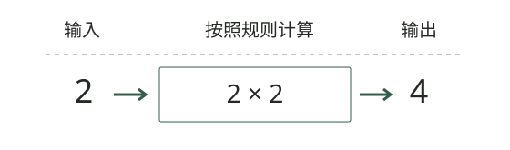
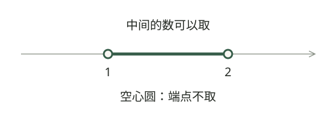
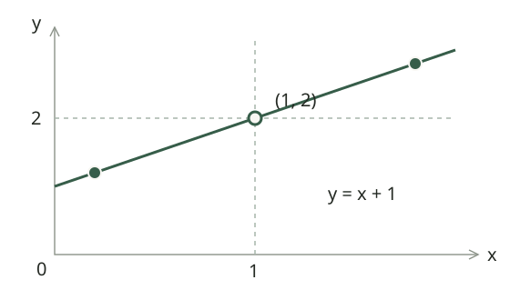
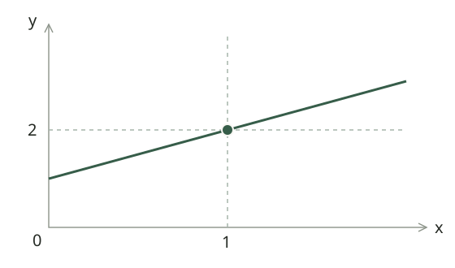

# 第1章 函数、极限与连续 · 零基础阅读版

**第一遍，只沿着这条路线读**

先认符号 → 函数：输入怎么算成输出 → 极限：附近趋向哪里 → 连续：能不能接上 → 基础计算 → 自己练一练。

每张图都先观察，再对照文字。后面的“进一步学习”默认折叠，第一遍不用全部读完。

## 阅读前 · 先认识几个符号

这一页从会加减乘除开始讲，不要求你先学过高等数学。遇到陌生符号可以随时回到这里。

- **x、y：**给数取的名字。x可以换成不同的数；y常用来表示算出来的结果。
- **平方：**\(x^2=x\times x\)。例如2²=4，(−2)²也等于4。
- **平方根：**\(\sqrt4=2\)，表示找一个非负数，让它乘自己等于4。实数范围内不能对负数这样开平方根。
- **大于与不小于：**\(x>1\) 不包括1；\(x\ge1\) 包括1。小于号的读法类似。
- **区间：**\((1,2)\) 表示1与2之间、不取端点；\([1,2]\) 表示连端点也取。圆括号“不取”，方括号“取”。
- **无穷与并集：**\(+\infty\) 表示向大的方向没有尽头，不是一个能取到的数；\(\cup\) 表示把两段允许的范围合在一起。
- **代入：**把式子里的字母换成给定的数，再按运算顺序计算。
- **绝对值：**\(|x|\) 表示这个数在数轴上离0多远，因此 \(|{-3}|=3\)、\(|3|=3\)。\(|x-1|\) 则表示x与1之间的距离。
- **实数与属于：**这里用到的整数、分数、小数，以及平方根得到的数，都在实数范围内。\(x\in D\) 读作“x属于D”，意思是x在D这个允许范围里。

先做到“读得出这句话在问什么”，再去算。暂时不认识ln、sin、ε等符号也没关系，它们放在后面的拓展内容里。

          

## 1.1 函数：输入怎么算成输出

### 从一个能算出来的问题开始

假设一本练习本卖3元，买 \(x\) 本要付 \(y\) 元，那么 \(y=3x\)。这里 \(x\) 是你决定的输入，\(y\) 是跟着变化的输出，乘以3就是对应规则。买2本付6元，买5本付15元：函数研究的就是这种“给定一个量，另一个量怎样确定”的关系。

这个例子还提醒我们：**公式之外，要看允许输入什么。**如果按整本出售，\(x\) 只能取0、1、2……；单看代数式 \(y=3x\)，实数都能代入，但负数本、半本不符合这个情境。实际问题的定义域，要同时考虑运算和实际含义。

接下来读到 \(f\left(x\right)\) 时，先在心里翻译成“规则 \(f\) 处理输入 \(x\) 后的结果”。\(f\left(2\right)\) 是把2代进去，**不是 \(f\) 乘以2**。例如 \(f\left(x\right)=x^{2}+1\)，那么 \(f\left(2\right)=2^{2}+1=5\)。

现在把“按规则算出结果”这件事取一个数学名字：**函数**。函数要说清楚两件事：允许输入哪些数，以及每个允许的输入对应哪个输出。一个输入只能对应一个确定的输出。

例如，\(y=x^{2}\) 把每一个实数 \(x\) 对应到一个非负实数 \(y\)。输入2和输入−2虽然不同，但输出都等于4；这不影响它是函数。真正不能发生的情况是：同一个输入值同时对应两个不同的输出值。

把函数写成

$$
y=f(x),\quad x\in D
$$

时，\(D\) 是定义域，表示允许输入的所有 \(x\)；函数值 \(f\left(x\right)\) 所组成的集合叫值域。定义域决定“能不能代入”，值域决定“代入之后可能得到什么”。

### 动手试一试 · 输入变了，输出怎么算

先拖动滑块选一个数，自己算出它的平方，再看图中的结果。

输入2，按“自己乘自己”的规则，得到4。

再试试−2：它与2的输出相同。不同输入可以得到同一输出；但同一个输入按这条规则只能得到一个结果。

网页版提供滑块或切换按钮；此处为初始状态的静态图。

### 定义域和值域：用同一个例子分清

设 \(f\left(x\right)=x^{2}\)，并规定 \(-2\le x\le 1\)。允许输入的数是整个区间 [−2,1]，这就是定义域。把这些数平方，最小能得到0，最大能得到4，而且中间的每个值都能取到，所以值域是 [0,4]。

为什么不是 [1,4]？因为不能只把两个端点平方。输入0也被允许，而 \(f\left(0\right)=0\)。**找值域，要看整个输入范围内的输出，不能只看端点。**

另一个容易混淆的问题是 \(y^{2}=x\)。给 \(x=4\)，会出现 \(y=2\) 和 \(y=-2\)，所以它没有直接确定“\(y\) 是 \(x\) 的函数”。加上 \(y\ge 0\) 的限制，选定 \(y=\sqrt{x}\) 后，每个允许的 \(x\) 才有唯一输出。

### 看图读区间 · (1, 2) 表示哪些数

数轴上，越往右数越大。绿色线段表示可以取的范围；看端点是空心还是实心，就知道端点能不能取。

1.5在线段中间，可以取；1和2在空心端点上，不能取。如果端点画成实心圆，就表示那个端点也可以取。

### 定义域：函数能够接受哪些输入

求定义域，就是找出所有能让计算顺利进行的输入。如果一道题有几个限制，输入必须同时满足它们；数学上把这个共同允许的范围叫“交集”。下面的 \(g(x)\) 表示式子中的某一部分，比如 \(x-1\)。

| 表达式中出现的部分 | 必须满足的条件 | 原因 |
| --- | --- | --- |
| \(\frac{1}{g\left(x\right)}\) | \(g\left(x\right)\ne 0\) | 分母不能为零 |
| \(\sqrt{g\left(x\right)}\) | \(g\left(x\right)\ge 0\) | 平方根里面不能是负数 |

先做一道只有一个限制的题

求 \(f(x)=\sqrt{x-1}\) 的定义域，也就是：哪些输入可以代进去？

**先想原因：**我们只在实数范围内计算，平方根里的数不能是负数，所以要求 \(x-1\ge0\)。

**再解条件：**两边同时加1，得到 \(x\ge1\)。用话说，就是“1以及比1大的数都允许”，记作 \([1,+\infty)\)。

**最后检查：**代入1，根号里是0，可以；代入2，根号里是1，也可以；代入0，根号里是−1，不在允许范围内。

先能完成“代入求值”和“找出不允许的输入”就可以继续读。函数性质、复合函数和完整定义域题放在进一步学习中。

          

## 1.2 极限：附近的值趋向哪里

这一节只问一个问题：**输入的数越来越靠近某个位置时，输出会越来越靠近哪个数？**这就是极限要描述的事情。先看下面的例子和会动的点，再看写法。

### 函数极限

记号 \(x\to1\) 读作“x趋于1”，意思是越来越靠近1，不是把x直接设为1。\(\lim_{x\to1}f(x)=2\) 读作“x趋于1时，f(x)的极限是2”。

考虑函数

$$
f(x)=\frac{x^2-1}{x-1}
$$

先拆开分子：\(x^2-1=(x-1)(x+1)\)。可以乘回去检查：\((x-1)(x+1)=x^2+x-x-1=x^2-1\)。这种把一个式子写成几个部分相乘的做法，叫“因式分解”。当 \(x\ne1\) 时，分子、分母都含有的 \(x-1\) 不为0，可以约掉，所以

$$
f(x)=x+1
$$

原函数在 \(x=1\) 时没有定义，但当 \(x\) 越来越接近1时，\(x+1\) 越来越接近2。因此

$$
\lim_{x\to1}\frac{x^2-1}{x-1}=2
$$

          

极限关心的是目标点附近的变化。附近一直在靠近2，不等于这个点真正取到2；这个点甚至可以没有定义。这正是“极限存在”和“函数在该点连续”不能混为一谈的原因。

第一次看这种图：横轴x表示输入，纵轴y表示输出。点(1,2)的意思是“输入1，输出2”；先在横轴找到1，再向上找到高度2。绿色直线记录输入、输出的对应关系，空心圆表示这个位置没有真正取到。

### 动手看极限 · 附近越来越近，目标点可以空着

拖动滑块，观察左右两点。先看输入是否都靠近1，再看两个输出是否都靠近2。

空心点表示原函数在x=1处没有定义。

图中只演示有限次靠近，不是极限的证明。滑到最右也不会让输入等于1；真正的极限说的是：误差可以按要求继续变小。空心点的位置是(1,2)。

网页版提供滑块或切换按钮；此处为初始状态的静态图。

### 为什么没有 \(f\left(1\right)\)，却能算 \(x\to 1\) 的极限

| 靠近方向 | \(x\) 的取值 | \(\frac{x^{2}-1}{x-1}\) |
| --- | --- | --- |
| 从左侧 | 0.9；0.99；0.999 | 1.9；1.99；1.999 |
| 从右侧 | 1.1；1.01；1.001 | 2.1；2.01；2.001 |
| 恰好在目标点 | 1 | 原式无定义 |

表格帮助我们猜到目标是2，但有限几个数不能代替证明。真正的理由是：只要 \(x\ne 1\)，原式就等于 \(x+1\)，于是输出与2的距离恰好等于输入与1的距离：

$$
|f(x)-2|=|(x+1)-2|=|x-1|,\quad x\ne1
$$

想让输出离2不到0.001，就让输入离1不到0.001，并且不取1本身。把0.001换成更小的误差，这个方法仍然成立。这比“看几个数字差不多”更有说服力。严格的符号写法放在后面的进一步学习中。

如果单独补上 \(f\left(1\right)=100\)，附近的输出仍趋于2，极限仍是2。**目标点的函数值回答“到站后在哪儿”，极限回答“沿路正在靠近哪儿”。**两者能不能接上，是后面连续性要检查的问题。

### 左右极限

从左侧接近 \(a\)，记作 \(\lim_{x\to a^-}f(x)\)；从右侧接近 \(a\)，记作 \(\lim_{x\to a^+}f(x)\)。只有左右两边都趋近于同一个数，双侧极限才存在：

$$
\lim_{x\to a}f(x)=L\iff\lim_{x\to a^-}f(x)=\lim_{x\to a^+}f(x)=L
$$

当题目在某个位置换了一套计算规则时，先分别看左边和右边。下面的大括号表示“分情况计算”：输入小于1，用第一行；输入大于或等于1，用第二行。

            

例题　分段函数的极限

设

$$
f(x)=\begin{cases}x+1,&x<1,\\2x-1,&x\ge1.\end{cases}
$$

求 \(\lim _{x\to 1}f\left(x\right)\)。

              

**左边：**当 \(x<1\) 时使用第一段，所以 \(\lim_{x\to1^-}f(x)=2\)。

**右边：**当 \(x\ge 1\) 时使用第二段，所以 \(\lim_{x\to1^+}f(x)=1\)。

两侧结果不同，因此双侧极限不存在。即使 \(f\left(1\right)=1\) 有定义，也不能改变这个结论。

          

### 分段函数：先确定站在哪一侧，再选择公式

求 \(x\to 1^{-}\) 的极限时，可以想一个略小于1的数，例如0.99。它落在 \(x\)<1 这一段，所以用 \(x+1\)。求 \(x\to 1^{+}\) 时，想1.01，它落在另一段，所以用 \(2x-1\)。**分界点上的等号决定 \(f\left(1\right)\)，不能代替附近左右两边的判断。**

入门例题　绝对值也藏着两段规则

求 \(x\to 0\) 时 \(\frac{|x|}{x}\) 的极限。先按正负去掉绝对值：\(x\)>0 时 \(|x|=x\)，所以比值是1；\(x\)<0 时 \(|x|=-x\)，所以比值是−1。

因此右极限为1，左极限为−1，双侧极限不存在。把 \(x=0\) 代进去得到 0/0，只能提醒我们需要进一步分析，不能直接用它宣布“没有极限”。

## 1.3 连续：附近和这个点能不能接上

连续性描述函数在某一点附近的变化是否“接得上”。它不是单纯看图像有没有断口，而是一个同时包含函数值和极限的条件。

### 切换比较 · 连续要同时检查附近和这个点

实心点表示函数在x=1处真正取到的值；空心点表示该位置不取。逐个切换，看看改动一个点能解决什么。

左侧趋于2，右侧也趋于2，点值为2：三者相等，所以连续。

先看两侧趋向哪里，再看实心点放在哪里。“少一个点”和“点值不对”能靠补点或改点修好；“左右不齐”不能只靠改一个点修好。

网页版提供滑块或切换按钮；此处为初始状态的静态图。

函数 \(f\left(x\right)\) 在 \(x=a\) 处连续，需要同时满足：

1. \(f\left(a\right)\) 有定义；
2. \(\lim _{x\to a}f\left(x\right)\) 存在；
3. \(\lim _{x\to a}f\left(x\right)=f\left(a\right)\)。

          有函数值 + 有极限 + 极限等于函数值

这三个条件要逐个检查。只有极限存在，不能说明连续；只有函数值存在，也不能说明连续；两者都存在但不相等，同样不连续。

### 连续三条件：把“附近的点”和“这个点”分开看

仍然用 \(x\ne 1\) 时 \(f\left(x\right)=x+1\) 这个例子，附近的函数值都趋于2。只改变 \(x=1\) 处的定义，会出现三种情况：

| 在 \(x=1\) 怎么定义 | 极限 | 是否连续 |
| --- | --- | --- |
| 不定义 \(f\left(1\right)\) | 2 | 不连续：少了这个点 |
| 定义 \(f\left(1\right)=100\) | 2 | 不连续：这个点放错了高度 |
| 定义 \(f\left(1\right)=2\) | 2 | 连续：这个点与附近趋势接上 |

前两种都只需补上或改动一个点，就能使函数连续，所以叫“可去”间断。若左边趋于2、右边趋于1，改动分界点的一个值不可能同时接住两边，这就是跳跃间断不能靠补一个点解决的原因。

例题　确定参数使函数连续

设

$$
f(x)=\begin{cases}\dfrac{x^2-1}{x-1},&x\ne1,\\a,&x=1.\end{cases}
$$

求 \(a\) 的值，使 \(f\left(x\right)\) 在 \(x=1\) 处连续。

              

由于 \(f\left(1\right)=a\) 已经有定义，只需要让极限等于这个函数值：

$$
\lim_{x\to1}\frac{x^2-1}{x-1}=\lim_{x\to1}(x+1)=2
$$

所以必须有 \(a=2\)。如果把 \(a\) 取成其他数，函数在 \(x=1\) 处就会出现可去间断。

          

第一次读到这里，能说清“附近趋向的值”和“这个点真正的值”有什么区别，就抓住了连续性的关键。间断点名称和更多定理可以稍后再学。

## 1.4 基础计算：把每一步说清楚

前面已经知道极限在问什么。现在先练两种能用中学代数完成的方法：**分解后约分**和**根号差的有理化**。不急着一次记住所有方法。

建议形成以下顺序：

1. 先看输入靠近哪里；分段处要区分左右。
2. 如果这里连续，直接代入能得到有意义的数，就可以算出极限。
3. 出现0/0时，先找能否因式分解、约分，或把根号差改写。
4. 每化简一步，都说出使用的条件，最后再代入检查。

### 先分清：0/0 是题目的状态，不是答案

下面三题在 \(x\to 0\) 时，分子分母都趋于0，结果却不同：\(\frac{x}{x}=1\)；\(\frac{x^{2}}{x}=x\to 0\)；\(\frac{x}{x^{2}}=\frac{1}{x}\)，左右分别趋于相反的无穷，没有有限双侧极限。

所以“0/0 型”只表示：分子和分母都在缩小，**还不知道谁缩得更快**。我们要继续化简，看看分子除以分母到底趋向哪个数。它不是一个合法的除法结果。

代入则有前提：例如 \(x^{2}+1\) 在 \(x=2\) 连续，所以极限为5；分段函数在分界点即使能代入，也必须先看两侧。每种方法都有适用条件，不能跳过检查。

### 直接代入与代数化简

像 \(x+1\)、\(x^2+1\) 这样由常数和字母的非负整数次幂相加减组成的式子，叫“多项式”。它们在每个实数处都连续，可以直接代入求极限。

            

例题　因式分解消去 \(\frac{0}{0}\)

求

$$
\lim_{x\to1}\frac{x^2-1}{x-1}
$$

              

直接代入得到 \(\frac{0}{0}\)，说明当前形式不能直接给出答案，但不代表极限不存在。分子因式分解：

$$
\frac{x^2-1}{x-1}=x+1,\quad x\ne1
$$

因此原极限等于 \(\lim _{x\to 1}\left(x+1\right)=2\)。

          

            

例题　有理化

求 \(\lim _{x\to 0}\frac{\sqrt{1+x}-\sqrt{1-x}}{x}\)。

              

分子有理化：

$$
\frac{\sqrt{1+x}-\sqrt{1-x}}{x}=\frac{2}{\sqrt{1+x}+\sqrt{1-x}}
$$

代入 \(x=0\) 得极限为 \(1\)。

          

### 有理化为什么能把根号差算下去

上面的根号题，直接代入是0/0。看到两个根号相减，可以想到平方差：\(\left(A-B\right)\left(A+B\right)=A^{2}-B^{2}\)。把分子分母同时乘以 \(\sqrt{1+x}+\sqrt{1-x}\)，相当于乘了一个值为1的分式，原式没有变。

$$
\frac{\sqrt{1+x}-\sqrt{1-x}}{x}=\frac{(1+x)-(1-x)}{x\bigl(\sqrt{1+x}+\sqrt{1-x}\bigr)}
$$

现在分子变成\(2x\)。极限考察 \(x\ne 0\) 的附近，可以约去 \(x\)，得到 \(\frac{2}{\sqrt{1+x}+\sqrt{1-x}}\)。这时分母趋于2，不再是0，才可以直接代入，结果是1。

**回顾选择理由：**根号差 → 想平方差 → 乘共轭式 → 消去造成0/0的因子 → 再代入。以后换成 \(\sqrt{1+2x}-1\)，也可以沿着这条思路走。

基础部分先做到：知道0/0不是答案，能解释为什么约分和有理化有效。更多计算方法按所需基础放在进一步学习中。

## 1.5 自己练一练

先完成下面4题。写出你用的规则，再展开提示或解析核对；不需要一次学完所有拓展方法。

### 练习1　把限制条件同时用上

求 \(f\left(x\right)=\frac{\sqrt{x+1}}{x-2}\) 的定义域。

需要一点提示

先分别检查根式和分母，再取交集。

展开逐步解析

根式要求 \(x\ge -1\)；分母要求 \(x\ne 2\)。两者同时满足，定义域为 \(\left[-1,2\right)\cup \left(2,+\infty \right)\)。−1可以取，因为根式为0没有问题；2必须排除，因为它使分母为0。

### 练习2　先消去造成0/0的因子

求 \(x\to 2\) 时 \(\frac{x^{2}-4}{x-2}\) 的极限。

需要一点提示

\(x^{2}-4\) 是平方差。

展开逐步解析

分子、分母都趋于0，先分解 \(x^{2}-4=\left(x-2\right)\left(x+2\right)\)。在 \(x\ne 2\) 的附近约分，原式等于 \(x+2\)，所以极限为4。这个结论并没有给原式在 \(x=2\) 处补上定义。

### 练习3　换一个根号，方法还能用吗

求 \(x\to 0\) 时 \(\frac{\sqrt{1+2x}-1}{x}\) 的极限。

需要一点提示

乘以共轭式 \(\sqrt{1+2x}+1\)。

展开逐步解析

分子分母同乘共轭式后，分子为 \(\left(1+2x\right)-1=2x\)。约去 \(x\)，得到 \(\frac{2}{\sqrt{1+2x}+1}\)，再代入0，结果是1。不能把根号分开写成\(1+\sqrt{2x}\)。

### 练习4　改一个点能不能让它连续

设 \(f\left(x\right)=x+1\)（\(x\)<0），\(f\left(0\right)=a\)，\(f\left(x\right)=2x+1\)（\(x\)>0）。求使它在0处连续的 \(a\)。若右侧改为\(2x+2\)，还存在这样的 \(a\) 吗？

需要一点提示

先算左右极限，最后才看 \(a\)。

展开逐步解析

原题左极限为1，右极限也为1，因此 \(a=1\)。右侧改为\(2x+2\)后，右极限为2、左极限为1，双侧极限不存在；无论 \(a\) 取什么值，都不能让它连续。

如果答案错了，先判断卡在哪里：条件漏了，回看定义域；不会选公式，回看左右极限；知道答案却说不清过程，回看约分和有理化的每一步；把左右相等当成连续，回看“左极限＝点值＝右极限”。

学完对应拓展内容后，再做这5题

### 拓展1　复合函数先算谁

设 \(f\left(x\right)=\sqrt{x}\)，\(g\left(x\right)=x-3\)，求 \(f\left(g\left(x\right)\right)\) 和 \(g\left(f\left(x\right)\right)\) 的定义域。

需要一点提示

把“先算谁”用箭头写出来。

展开逐步解析

\(f\left(g\left(x\right)\right)=\sqrt{x-3}\)，要求 \(x\ge 3\)，定义域 \(\left[3,+\infty \right)\)。\(g\left(f\left(x\right)\right)=\sqrt{x}-3\)，先开根号，要求 \(x\ge 0\)，定义域 \(\left[0,+\infty \right)\)。同样两个函数，运算顺序不同，允许的输入就不同。

### 拓展2　认准内部的小量

求 \(x\to 0\) 时 \(\frac{\ln \left(1+4x\right)}{\sin \left(2x\right)}\) 的极限。

需要一点提示

分子整体与\(4x\)等价，分母整体与\(2x\)等价。

展开逐步解析

因为\(4x\)和\(2x\)都趋于0，原式与\(\frac{4x}{2x}\)有相同极限，得到2。完整理由是 \(\frac{\ln \left(1+4x\right)}{4x}\to 1\)，\(\frac{\sin \left(2x\right)}{2x}\to 1\)，剩下的系数比为\(\frac42\)。

### 拓展3　有界的振荡乘上无穷小

求 \(x\to 0\) 时 \(x^{2}\sin \left(\frac{1}{x}\right)\) 的极限，并解释为什么不能把两个因子的极限直接相乘。

需要一点提示

先用 \(|\sin \left(\frac{1}{x}\right)|\le 1\)。

展开逐步解析

有 \(|x^{2}\sin \left(\frac{1}{x}\right)|\le x^{2}\)，而 \(x^{2}\to 0\)，所以由夹逼准则，极限为0。\(\sin \left(\frac{1}{x}\right)\) 本身没有极限，不能写成 \(\lim x^{2}\) 乘以 \(\lim \sin \left(\frac{1}{x}\right)\)；但它有界，因此可以用夹逼或“有界量乘无穷小”。

### 拓展4　证明有根，不必先解出根

证明 \(x^{3}+x-1=0\) 在 (0,1) 内恰好有一个实根。

需要一点提示

先用零点定理证存在，再说明严格单调。

展开逐步解析

令 \(F\left(x\right)=x^{3}+x-1\)。它在 [0,1] 连续，\(F\left(0\right)=-1\)、\(F\left(1\right)=1\)，端点异号，所以在 (0,1) 至少有一个零点。\(x^{3}\)与\(x\)都严格递增，故 \(F\) 严格递增，零点至多一个。合起来是恰好一个。无需写出根的具体数值。

### 拓展5　抵消以后保留什么

求 \(x\to 0\) 时 \(\frac{e^{x}-1-x}{x^{2}}\) 的极限，并解释为什么 \(e^{x}\sim 1\) 不能直接用于本题。

需要一点提示

保留到二阶，把余项写成 \(o\left(x^{2}\right)\)。

展开逐步解析

\(e^{x}=1+x+\frac{x^{2}}{2}+o\left(x^{2}\right)\)，相减后分子为 \(\frac{x^{2}}{2}+o\left(x^{2}\right)\)，除以 \(x^{2}\) 得\(\frac{1}{2}+\frac{o\left(x^{2}\right)}{x^{2}}\to \frac{1}{2}\)。\(e^{x}\sim 1\) 只保留了常数层面的信息，本题恰好会减去常数项和一次项，必须继续保留二次项。

## 1.6 进一步学习

这一部分保留完整的方法与例题。第一次阅读可以先跳过；学完前面的内容，再按标题选择要补的知识。涉及导数、积分的方法，等学到对应章节后再回来看。

函数的更多知识：性质、复合与反函数

先能读懂函数、代入求值，再学习这里。每个新名称都在回答一个具体问题。

### 函数的常见性质

函数的性质不是孤立的记忆点，它们会在后面的极限、导数和作图中反复出现。

| 性质 | 含义 | 判断时先看什么 |
| --- | --- | --- |
| 有界性 | 函数值不会超过某个固定范围 | 是否存在 \(M>0\) 使 \(\|f\left(x\right)\|\le M\)；必须指明区间 |
| 单调性 | 自变量增大时，函数值整体增大或减小 | 比较 \(x_{1}<x_{2}\) 时的函数值 |
| 奇偶性 | 图像关于原点或纵轴对称 | **定义域是否关于原点对称** |
| 周期性 | 图像按固定长度重复 | 是否存在 \(T>0\) 使 \(f\left(x+T\right)=f\left(x\right)\) |

判断奇偶性时，第一步永远是检查定义域。比如 \(\ln x\) 的定义域是 \(\left(0,+\infty \right)\)，不关于原点对称，因此它既不是奇函数，也不是偶函数；不能只代入 \(f\left(-x\right)\) 进行形式计算。若奇函数在 \(x=0\) 有定义，则必有 \(f\left(0\right)=0\)。

有界性必须结合区间讨论。\(\frac{1}{x}\) 在 \(\left(0,1\right)\) 上无界，在 \(\left[1,+\infty \right)\) 上有界；离开区间谈“有没有界”没有意义。

### 这些性质分别在问什么

**有界性问“能不能给所有输出套上一个固定范围”。**\(\sin x\) 始终在 −1 与1之间，因此有界。\(\frac{1}{x}\) 在 (0,1) 上却可以取到10、100、1000……，你给出多大的上限，都能用更小的正数 \(x\) 超过它。

**单调性问“输入往右走，输出是否一直朝同一方向变化”。**\(x^{2}\) 在 \(\left[0,+\infty \right)\) 上递增，但在整个实数范围上并不递增：从 −2 到 −1，输出从4降到1；从1到2，输出又从1升到4。判断时一定说清区间。

**奇偶性问“相反的两个输入，输出有什么关系”。**\(x^{2}\) 在2与−2处都输出4，是偶函数；\(x^{3}\) 在2与−2处分别输出8与−8，是奇函数。若定义域只允许正数，另一边的输入根本不存在，就不能这样成对比较。

**周期性问“往右平移固定距离后，整套输出是否重复”。**\(\sin \left(x+2\pi \right)=\sin x\)，说明\(2\pi\)是一个周期；偶函数的左右对称并不等于周期重复，例如 \(x^{2}\) 是偶函数，却不是周期函数。

### 复合函数与反函数

例题　复合函数的定义域

设 \(f\left(x\right)=\sqrt{x}\)，\(g\left(x\right)=x^{2}-1\)，求 \(f\left(g\left(x\right)\right)\) 与 \(g\left(f\left(x\right)\right)\) 的定义域。

              

**\(f\left(g\left(x\right)\right)\)：**即 \(\sqrt{x^{2}-1}\)，要求 \(x^{2}-1\ge 0\)，即 \(|x|\ge 1\)，定义域为 \(\left(-\infty ,-1\right]\cup \left[1,+\infty \right)\)。

**\(g\left(f\left(x\right)\right)\)：**化简得 \(x-1\)，但内层 \(\sqrt{x}\) 要求 \(x\ge 0\)，所以定义域是 \(\left[0,+\infty \right)\)，不能只看化简后的式子。

          

复合函数就是“先做一层运算，再把结果送入下一层”。若

$$
u=g(x),\quad y=f(u)
$$

那么复合后写成 \(y=f\left(g\left(x\right)\right)\)。复合函数成立的关键是：内层函数的输出，必须落在外层函数的定义域内。

反函数则是把输入和输出的角色交换。一一对应是反函数存在的本质；在区间上严格单调是常用的充分条件；仅单调不减而有水平段时，仍可能无法唯一找回输入。图像上，原函数与反函数关于直线 \(y=x\) 对称，且

$$
D_f=R_{f^{-1}},\qquad R_f=D_{f^{-1}}
$$

### 反函数：能不能根据结果找回输入

入门例题　把每一步运算倒过来

设 \(f\left(x\right)=2x+3\)。正着算是“乘2，再加3”；倒着算就应当“减3，再除以2”。从 \(y=2x+3\) 解出 \(x=\frac{y-3}{2}\)，再把表示输入的字母改写为 \(x\)，得到 \(f^{-1}\left(x\right)=\frac{x-3}{2}\)。

核对一下：\(f\left(4\right)=11\)，反函数把11送回4，因为 (11−3)/2=4。这里 \(f^{-1}\) 表示反函数，**不是倒数 \(\frac{1}{f\left(x\right)}\)**。

为什么 \(x^{2}\) 在整个实数范围上没有反函数？因为看到输出4，无法知道原来的输入是2还是−2。把原函数的定义域限制为 \(\left[0,+\infty \right)\)，才可以用 \(\sqrt{x}\) 唯一找回输入。

### 初等函数

基本初等函数包括：幂函数、指数函数、对数函数、三角函数、反三角函数。由常数和基本初等函数经过有限次四则运算与复合得到、并能用一个式子表示的函数，称为初等函数。这里有一条常用结论：

          初等函数在其定义区间内连续

这可以省去大量“验证连续”的步骤：只有在分界点、无定义点、人为定义的分段点，才必须回到连续定义去检查。

认识对数、三角函数后，再练完整的定义域题

ln、sin、arcsin 等是另外几种函数的名称。暂时不熟悉它们时，不必从这道综合例题开始。基础部分先练“分母不能为0、根号里不能为负数”这两条。

| 表达式 | 允许的条件 | 说明 |
| --- | --- | --- |
| \(\ln g\left(x\right)\) | \(g\left(x\right)>0\) | 对数真数必须为正 |
| \(\arcsin g\left(x\right)\) | \(-1\le g\left(x\right)\le 1\) | 反正弦的结果必须为实数 |
| \(\tan x\) | \(x\ne \frac{\pi }{2}+k\pi\) | 正切在这些点无定义 |
| \(\cot x\) | \(x\ne k\pi\) | 余切在这些点无定义 |

最容易漏掉的是“分母不能为零”。例如，\(\ln \left(x-1\right)\) 不仅要求 \(x-1>0\)，还不能等于0，因为它整体处在分母位置。

例题　求函数的定义域

求函数

$$
f(x)=\frac{\sqrt{2-x}}{\ln(x-1)}
$$

的定义域。

              

**第一步：处理根式。**根式要求 \(2-x\ge 0\)，所以 \(x\le 2\)。

**第二步：处理对数。**对数要求 \(x-1>0\)，所以 \(x>1\)。

**第三步：处理分母。**分母不能为零。\(\ln \left(x-1\right)=0\) 等价于 \(x-1=1\)，所以 \(x=2\) 必须排除。

**第四步：取交集。**综合得到

$$
D=(1,2)
$$

          

### 回头看定义域题：每一步到底在排除什么

求定义域就像过几道关卡：过了根式这一关，还要过对数这一关，最后还要过分母这一关。交集的意思是“每一关都通过”，并集则是“过一关就算”，显然后者不够。

上面的 \(\frac{\sqrt{2-x}}{\ln \left(x-1\right)}\)，可以用几个点核对：\(x=1\) 时对数的真数为0、没有意义；\(x=1.5\) 时三项要求都满足；\(x=2\) 时分母为0。这样可以检查答案 (1,2) 的两个端点为什么都不取。代点是核对，完整答案仍由不等式求交集得到。

复合函数也按“过关”的顺序看。算 \(g\left(f\left(x\right)\right)\) 要先算 \(f\left(x\right)\)，再把结果交给 \(g\)。即使最后化简成 \(x-1\)，也不能让最开始无法通过 \(\sqrt{x}\) 的负数输入重新进来。

从数列认识极限，以及更严格的定义

如果已经理解“输入靠近、输出跟着靠近”，可以再看数列。n只是“第几项”的编号；ε表示允许误差，N表示从哪一项开始能保证满足要求。

### 先看数字怎样变化，再读极限符号

先把 \(a_{n}=\frac{1}{n}\) 的前几项写出来：1、1/2、1/3、1/4……。下标 \(n\) 表示“第几项”，\(a_{n}\) 表示“这一项的数值”。当 \(n\) 越来越大，\(\frac{1}{n}\) 会越来越小。

| 第几项 \(n\) | 数值 \(\frac{1}{n}\) | 离0的距离 |
| --- | --- | --- |
| 10 | 0.1 | 0.1 |
| 100 | 0.01 | 0.01 |
| 1000 | 0.001 | 0.001 |

如果要求误差小于0.01，选 \(n\)>100 就够了；要求小于0.0001，选 \(n\)>10000 就够了。无论把误差要求提得多严格，都能从某一项起，让**后面的每一项**满足要求。这才是极限为0的含义。

注意两个词：“从某项起”和“每一项”。偶尔靠近0还不够。例如 0、1、0、1……，虽然反复出现0，却总会回到1，因此不收敛。极限也不要求最后真的等于目标，\(\frac{1}{n}\) 的每一项都大于0，极限仍然是0。

下面的 \(\varepsilon\) 只是“允许误差”的名字，\(N\) 是“从哪里开始能保证合格”的门槛。先读懂上面的数字例子，再看符号就不必硬背。

### 数列极限

数列可以看成定义在正整数集上的函数 \(a_{n}\)。数列极限研究：当下标 \(n\) 无限增大时，\(a_{n}\) 是否无限接近某个固定数 \(A\)：

$$
\lim_{n\to\infty}a_n=A
$$

严格的 \(\varepsilon -N\) 语言是：对任意 \(\varepsilon >0\)，都能找到正整数 \(N\)，使当 \(n>N\) 时有 \(|a_{n}-A|<\varepsilon\)。初学时先把这句话与上面的误差例子对应起来；熟悉以后，再练习如何根据 \(\varepsilon\) 找到 \(N\)。

几个必须记住的事实：

1. 收敛数列的极限唯一；
2. 收敛数列必有界；**有界不一定收敛**（反例 \(\left(-1\right)^{n}\)）；
3. 保号性：若 \(\lim a_{n}=A>0\)，则当 \(n\) 充分大时 \(a_{n}>0\)。

把“足够近”写严谨：ε和δ

这两个希腊字母只是两个数的名字：ε表示允许的输出误差，δ表示输入需要靠近到什么程度。先理解下面的例子，再逐步阅读符号定义。

这里的“接近”不是一句模糊的口号。它表示：只要 \(x\) 足够接近1，函数值就可以被控制得足够接近2。下面的\(\varepsilon\)—\(\delta\)定义把这种控制关系写成符号，后面会用具体误差解释。

$$
\begin{gathered}\forall\varepsilon>0,\ \exists\delta>0:\\0<|x-a|<\delta\ \Longrightarrow\ |f(x)-A|<\varepsilon\end{gathered}
$$

无穷小、无穷大和极限的性质

“无穷小”表示在所讨论的变化过程中趋于0，不是一个很小的固定数。先掌握有限目标点的极限，再读这些变化方式和运算性质。

还有一类 \(x\to \infty\) 的极限，表示 \(|x|\) 充分大时函数值无限接近某个数，计算时可与数列极限类比。

例题　经典左右极限

求 \(\lim _{x\to 0}e^{\frac{1}{x}}\)。

              

当 \(x\to 0^{+}\) 时，\(\frac{1}{x}\to +\infty\)，故 \(e^{\frac{1}{x}}\to +\infty\)；当 \(x\to 0^{-}\) 时，\(\frac{1}{x}\to -\infty\)，故 \(e^{\frac{1}{x}}\to 0\)。左右不一致，双侧极限不存在。

同理，\(\lim _{x\to 0}\arctan \left(\frac{1}{x}\right)\) 也不存在（左为 \(-\frac{\pi }{2}\)，右为 \(\frac{\pi }{2}\)）。

          

### 无穷小与无穷大

在某个变化过程中，极限为0的变量叫无穷小；绝对值无限增大的变量叫无穷大。它们描述的是变化趋势，不是某个“特别小”或“特别大”的固定数。

例如，当 \(x\to 0\) 时，\(x\)、\(\sin x\) 和 \(1-\cos x\) 都是无穷小；当 \(x\to \infty\) 时，\(x\) 是无穷大，而 \(\frac{1}{x}\) 是无穷小。

**无穷小的运算：**有限个无穷小之和仍是无穷小；有界量乘无穷小仍是无穷小；但**无穷多个无穷小之和不一定是无穷小**——这正是 \(n\) 项和数列极限的核心难点。

**无穷小与极限的关系：**

$$
\lim f(x)=A\iff f(x)=A+\alpha(x),\quad\alpha(x)\to0
$$

比较无穷小的阶，实际上是在比较它们趋近于0的速度：

| 关系 | 含义 |
| --- | --- |
| \(\frac{\beta }{\alpha }\to 0\) | \(\beta\) 是比 \(\alpha\) 高阶的无穷小，记 \(\beta =o\left(\alpha \right)\) |
| \(\frac{\beta }{\alpha }\to 1\) | \(\beta\) 与 \(\alpha\) 等价，记 \(\beta \sim \alpha\) |
| \(\frac{\beta}{\alpha^k}\to c\ne0\) | \(\beta\) 是 \(\alpha\) 的 \(k\) 阶无穷小 |

无穷大一定无界，但**无界不一定趋于无穷大**（如 \(x\sin x\) 在 \(x\to \infty\) 时无界，但不趋于无穷）。若 \(f\left(x\right)\to \infty\)，则 \(\frac{1}{f\left(x\right)}\to 0\)。

### “高阶”为什么反而更小

当 \(x\to 0\) 时，对比 \(x\) 和 \(x^{2}\)。取 \(x=0.1\)，分别是0.1和0.01；取 \(x=0.01\)，分别是0.01和0.0001。\(x^{2}\) 比 \(x\) 缩得更快，用比值看就是 \(\frac{x^{2}}{x}=x\to 0\)，所以 \(x^{2}\) 是比 \(x\) 高阶的无穷小。“高阶”说的是幂次或阶的关系，不是数值更大。

再比较 \(x+x^{2}\) 与 \(x\)：比值 \(\frac{x+x^{2}}{x}=1+x\to 1\)，所以二者等价。但它们相减恰好留下 \(x^{2}\)。若在差式中把 \(x+x^{2}\) 换成 \(x\)，留下的 \(x^{2}\) 就被你抹掉了。后面“等价无穷小不能随意用于加减”，原因就在这里。

还要说清变化过程：固定数0.000001虽然很小，却不会继续靠近0，所以它本身不是这个意义上的无穷小。每项都很小也不保证总和小：\(n\) 个 \(\frac{1}{n}\) 相加始终等于1。项数跟着 \(n\) 变多时，不能直接套用“有限个无穷小相加”的结论。

### 极限的性质

1. **唯一性**：极限若存在则必唯一。
2. **局部有界性**：极限存在 ⇒ 在某去心邻域内有界；收敛数列必有界。
3. **保号性**：若 \(\lim f=A>0\)，则充分靠近时 \(f>0\)；反过来，若去心邻域内 \(f\ge 0\) 且极限存在，则 \(A\ge 0\)（注意是“≥”，不能写成“>”）。
4. **四则运算**：在相应极限都存在的前提下，和差积的极限等于极限的和差积；商还要求分母的极限不为0。

四则运算要求每个参与的极限分别存在。若 \(\lim f\) 或 \(\lim g\) 不存在，不能拆开。反例：\(f=\sin \left(\frac{1}{x}\right)\)，\(g=-\sin \left(\frac{1}{x}\right)\) 在 \(x\to 0\) 时都无极限，但 \(f+g\) 恒等于 0。

间断点分类、含参数问题与闭区间定理

判断左右极限时，下面所说的“存在”都指**存在有限极限**。趋于无穷表示数值没有有限的落点，在间断点分类中归入第二类。

“可去”和“跳跃”是给不同断开方式起的名字。先能在前面的图里说清“哪里没接上”，再记名称和定理。

### 间断点的分类

如果函数在某点不连续，这个点叫间断点。判断时，可以先计算左右极限，再把结果和函数值比较。

| 类型 | 特征 | 典型表现 |
| --- | --- | --- |
| 第一类：可去间断点 | 左右极限相等，但函数无定义或函数值不等于极限 | 图像上像少了一个点 |
| 第一类：跳跃间断点 | 左右极限都存在，但不相等 | 左右两段无法接在一起 |
| 第二类：无穷间断点 | 至少一侧极限为 \(\infty\) | 如 \(\frac{1}{x}\) 在 0 |
| 第二类：振荡间断点 | 至少一侧极限不存在且不为无穷 | 如 \(\sin \left(\frac{1}{x}\right)\) 在 0 |

记忆要点：**第一类 = 左右极限都存在；第二类 = 至少一侧不存在**。初等函数在自己的定义区间内连续。考试中常把这个结论和分段函数结合起来：分段内部直接使用连续性，分界点必须回到定义，检查左右极限和函数值。

            

例题　可去间断

讨论 \(f\left(x\right)=\frac{\sin x}{x}\) 在 \(x=0\) 处。

              

\(f\left(0\right)\) 无定义，但 \(\lim _{x\to 0}\frac{\sin x}{x}=1\)，故 \(x=0\) 是可去间断点。补充定义 \(f\left(0\right)=1\) 后即连续。

          

            

例题　振荡间断

讨论 \(f\left(x\right)=\sin \left(\frac{1}{x}\right)\) 在 \(x=0\) 处。

              

当 \(x\to 0\) 时，\(\sin \left(\frac{1}{x}\right)\) 在 [−1,1] 之间无限振荡，极限不存在，故 \(x=0\) 是第二类间断点（振荡）。

          

            

例题　含双参数的分段连续

设 

$$
f(x)=\begin{cases}\dfrac{\sin(2x)}x,&x<0,\\a,&x=0,\\\dfrac{\ln(1+bx)}x,&x>0.\end{cases}
$$

 在 \(x=0\) 处连续，求 \(a,b\)。

              

左极限 \(\lim _{x\to 0^{-}}\frac{\sin 2x}{x}=2\)；右极限 \(\lim _{x\to 0^{+}}\frac{\ln \left(1+bx\right)}{x}=b\)。

连续要求左右极限都存在、相等，且等于 \(f\left(0\right)=a\)，故 \(a=b=2\)。

          

### 含参数连续题：把三个位置排在同一行

看到上面的双参数题，可以先写一张清单：左侧用 \(\frac{\sin \left(2x\right)}{x}\)，正好在0处取 \(a\)，右侧用 \(\frac{\ln \left(1+bx\right)}{x}\)。分别求出“左极限、点值、右极限”，最后让三个数相等。

$$
\lim_{x\to0^-}\frac{\sin(2x)}x=2\lim_{x\to0^-}\frac{\sin(2x)}{2x}=2
$$

右侧若 \(b\ne 0\)，则 \(\frac{\ln \left(1+bx\right)}{x}=b\cdot \frac{\ln \left(1+bx\right)}{bx}\to b\)；若 \(b=0\)，右侧表达式恒为0，极限仍是 \(b\)。对每个固定 \(b\)，在0的足够小邻域内都有\(1+bx\)>0，对数有意义。

$$
\underbrace{2}_{\text{左极限}}=\underbrace{a}_{\text{点值}}=\underbrace{b}_{\text{右极限}}\quad\Longrightarrow\quad a=b=2
$$

算完再代回去核对：此时左右都趋于2，点值也为2，三个条件全部满足。不能只令左右相等而漏掉点值 \(a\)。

### 闭区间上连续函数的性质

若函数在闭区间 \(\left[a,b\right]\) 上连续，则它不会在区间内部突然失去控制，并且一定能取得最大值和最小值。

**1. 有界性与最值定理。**存在 \(\xi ,\eta \in \left[a,b\right]\)，使 \(f\) 在这两点分别取到最大值与最小值。注意：开区间上连续不一定有最值（如 \(f\left(x\right)=x\) 在 \(\left(0,1\right)\) 上取不到最值）。

**2. 介值定理。**若 \(\mu\) 介于 \(f\left(a\right)\) 与 \(f\left(b\right)\) 之间，则至少存在一点 \(\xi \in \left[a,b\right]\)，使 \(f\left(\xi \right)=\mu\)。

**3. 零点定理。**如果端点函数值异号，那么区间内部至少有一个零点。

$$
\begin{gathered}f\in C[a,b],\quad f(a)f(b)<0\\\Longrightarrow\ \exists\xi\in(a,b),\quad f(\xi)=0\end{gathered}
$$

零点定理只能保证至少有一个根；如果还要证明根唯一，通常需要再结合单调性。

            

例题　证明方程有根

证明方程 \(x^{3}-3x+1=0\) 在 \(\left(0,1\right)\) 内至少有一个实根。

              

令 \(f\left(x\right)=x^{3}-3x+1\)，多项式处处连续。又 \(f\left(0\right)=1>0\)，\(f\left(1\right)=-1<0\)，故 \(f\left(0\right)f\left(1\right)<0\)。

由零点定理，存在 \(\xi \in \left(0,1\right)\) 使 \(f\left(\xi \right)=0\)。

          

            

例题　证明唯一零点

设 \(f\left(x\right)=x+e^{x}\)。证明 \(f\left(x\right)=0\) 在 \(\mathbb{R}\) 上有唯一实根。

              

**存在性：**函数在 [−1,0] 上连续，且 \(f\left(-1\right)=-1+e^{-1}<0\)，\(f\left(0\right)=1>0\)，由零点定理存在 \(\xi \in \left(-1,0\right)\)。

**唯一性：**\(f'\left(x\right)=1+e^{x}>0\)，函数严格单调增加，不可能有两个零点。

          

写零点定理题时务必交代：函数连续、端点异号、区间是闭区间。只写“因为 \(f\left(a\right)f\left(b\right)\)<0”而不验证连续，步骤是不完整的。

### 闭区间定理：为什么“连续”和“端点”都不能丢

想象一段没有断开的海拔曲线：起点在海平面下，终点在海平面上，中间必然经过海平面。零点定理用“连续”保证途中不能跳过去，用“端点异号”保证起点和终点分居0的两侧。

只知道端点异号不够。例如 \(f\left(x\right)=-1\)（\(x\)<0），\(f\left(x\right)=1\)（\(x\ge 0\)），在 [−1,1] 两端异号，却从来不等于0，因为它在0处跳了一下。端点异号只是零点存在的充分条件的一部分；端点同号也不代表没有零点，例如 \(x^{2}\) 在 [−1,1] 的两个端点都为1，中间仍有零点0。

最值定理也要看区间：\(f\left(x\right)=x\) 在 [0,1] 上能取到最小值0和最大值1；在 (0,1) 上仍有界，却取不到这两个端点值。**有界只说不超出某个范围，“有最大值”还要求某个输入真的取得它。**

证明根唯一还要多做一步。对 \(x+e^{x}\)，不用导数也能说明：\(x\) 增大时，\(x\) 和 \(e^{x}\) 都严格增加，所以它们的和严格增加，不可能两次取到0。再配合 [−1,0] 上连续且端点异号，就完成了“存在且唯一”。

更多极限方法：重要极限与等价替换

这里按方法保留了完整讲解。含sin、ln、e的题目需要先认识对应函数；泰勒、洛必达需要导数知识；定积分方法需要积分知识。可以按需阅读，不要求第一遍全部学完。

### 两个重要极限

三角函数极限中的角度一律按**弧度制**理解。\(\frac{\sin x}{x}\to 1\) 的公式不能把“度数”直接当成 \(x\) 代入。

第一个重要极限是

$$
\lim_{x\to0}\frac{\sin x}{x}=1
$$

它的核心用途是把含有 \(\sin x\) 的表达式改造成 \(\frac{\sin u}{u}\)（其中 \(u\to 0\)）。例如：

$$
\lim_{x\to0}\frac{\sin(3x)}{x}=\lim_{x\to0}\frac{\sin(3x)}{3x}\cdot3=3
$$

第二个重要极限最常用的形式是

$$
\begin{gathered}\lim_{x\to\infty}\left(1+\frac1x\right)^x=e\\\lim_{x\to0}(1+x)^{1/x}=e\end{gathered}
$$

更一般地，若 \(\alpha \left(x\right)\to 0\)，则 \(\left(1+\alpha \left(x\right)\right)^{\frac{1}{\alpha \left(x\right)}}\to e\)。当底数趋近1、指数趋向无穷时，不能直接把结果写成1。

### 底数接近1，为什么结果不一定是1

看 \(\left(1+\frac{1}{n}\right)^{n}\)：\(n=1\) 时是2，\(n=10\) 时约为2.594，\(n=100\) 时约为2.705。每次乘的数在靠近1，但相乘次数也在增加，这两种变化共同决定结果，最终趋于 \(e\approx 2.71828\)。

求 \(\left(1+3x\right)^{\frac{1}{x}}\) 的极限时，令 \(t=3x\)。底数变成\(1+t\)，指数 \(\frac{1}{x}=\frac{3}{t}\)。于是原式等于 \(\left[\left(1+t\right)^{\frac{1}{t}}\right]^{3}\)，方括号内趋于 \(e\)，所以答案是 \(e^{3}\)。这里的3不是凭记忆补上的，而是换元后指数带来的。

下面的快捷写法把这个过程概括了起来。使用时，底数在所讨论的附近要为正，且指数中的 \(v\left(u-1\right)\) 要有极限；否则不能把一个还没有求出的极限当成已知常数。

### \(1^{\infty }\) 型：三行式

设 \(u\to 1\)，\(v\to \infty\)，则

$$
\lim u^v=e^{\lim v(u-1)}
$$

当 \(u\) 在附近为正、\(u\to 1\) 且 \(v\left(u-1\right)\) 的极限存在时，可以用这一写法。推导要点：\(u^{v}=e^{v\ln u}\)，且 \(u\to 1\) 时 \(\ln u\sim u-1\)。

            

例题　标准 \(1^{\infty }\)

求 \(\lim _{x\to 0}\left(1+3x\right)^{\frac{1}{x}}\)。

              

**凑定义：**\(\left(1+3x\right)^{\frac{1}{x}}=\left[\left(1+3x\right)^{\frac{1}{3x}}\right]^{3}\to e^{3}\)。

**三行式：**\(v\left(u-1\right)=\left(\frac{1}{x}\right)\cdot 3x=3\)，故极限为 \(e^{3}\)。

          

            

例题　更一般的 \(1^{\infty }\)

求 \(\lim _{x\to \infty }\left[\frac{x+1}{x-1}\right]^{2x}\)。

              

因为 \(\frac{x+1}{x-1}=1+\frac{2}{x-1}\)，所以

$$
v(u-1)=2x\cdot\frac2{x-1}\to4
$$

极限为 \(e^{4}\)。

          

### 等价无穷小

当 \(x\to 0\) 时，可以逐步认识下面这些常用关系，不用第一次就全部记住：

$$
\begin{aligned}\sin x&\sim x,&\tan x&\sim x,\\\arcsin x&\sim x,&\arctan x&\sim x\end{aligned}
$$

$$
1-\cos x\sim\frac{x^2}{2},\quad\ln(1+x)\sim x,\quad e^x-1\sim x
$$

$$
\begin{aligned}a^x-1&\sim x\ln a,\\(1+x)^\alpha-1&\sim\alpha x,\\\log_a(1+x)&\sim\frac{x}{\ln a}\end{aligned}
$$

$$
\begin{aligned}x-\sin x&\sim\frac{x^3}{6},&\tan x-x&\sim\frac{x^3}{3},\\e^x-1-x&\sim\frac{x^2}{2},&\ln(1+x)-x&\sim-\frac{x^2}{2}\end{aligned}
$$

“等价”表示比值趋于1。它最适合出现在乘法因子或分式中；在加减式中把其中一项单独替换会破坏高阶项之间的差别。

看到加减号时先停一下：分别替换两个等价无穷小，可能把真正决定结果的高阶项全部消掉。正确做法是恒等变形、提取公因式，或用泰勒展开到足够阶。

            

例题　先化简，再使用等价无穷小

求

$$
\lim_{x\to0}\frac{\tan x-\sin x}{x^3}
$$

              

不能把分子中的 \(\tan x\) 和 \(\sin x\) 都直接替换成 \(x\)，因为这样会得到错误的零。先利用恒等式：

$$
\tan x-\sin x=\frac{\sin x(1-\cos x)}{\cos x}
$$

再使用 \(\sin x\sim x\)、\(1-\cos x\sim \frac{x^{2}}{2}\)、\(\cos x\to 1\)：

$$
\frac{\tan x-\sin x}{x^3}\sim\frac{x\cdot(x^2/2)}{1\cdot x^3}=\frac12
$$

          

            

例题　乘除结构直接替换

求 \(\lim_{x\to0}\frac{\ln(1+2x)}{\sin(3x)}\)。

              

分子分母都处在乘除位置，\(\ln \left(1+2x\right)\sim 2x\)，\(\sin 3x\sim 3x\)，故极限为 \(\frac{2}{3}\)。

          

### 等价替换：先练“整个因子”，再处理差

以 \(\frac{\ln \left(1+2x\right)}{\sin \left(3x\right)}\) 为例，不要只背一个2/3。因为 \(2x\to 0\)，\(\frac{\ln \left(1+2x\right)}{2x}\to 1\)；因为 \(3x\to 0\)，\(\frac{\sin \left(3x\right)}{3x}\to 1\)。把原式拆成：

$$
\frac{\ln(1+2x)}{2x}\cdot\frac{3x}{\sin(3x)}\cdot\frac23\to1\cdot1\cdot\frac23
$$

这解释了为什么分子整体可以换成\(2x\)、分母整体可以换成\(3x\)：两个被省去的比值都趋于1，不影响最后的结果。\(\ln \left(1+2x\right)\) 的“内部小量”是\(2x\)，不能漏掉系数2。

再回头看 \(\tan x-\sin x\)。两个单项都约等于 \(x\)，却不能说它们的差约等于0；要先化成 \(\frac{\sin x\left(1-\cos x\right)}{\cos x}\)，再替换整个乘法因子。**差里有抵消，抵消后剩下什么才决定答案。**

公式表中的 \(a\) 是常数，需 \(a\)>0 且 \(a\ne 1\)；\(\left(1+x\right)^{\alpha }-1\sim \alpha x\) 这一条需固定的 \(\alpha \ne 0\)。\(\alpha =0\) 时原式恒为0，不能再用“比值趋于1”描述两个恒零量。

学过导数后：泰勒与洛必达

这两种方法需要后面的求导知识。第一遍学习本章时可以保持折叠。

### 进阶方法的起点：先弄清“保留到几阶”

如果还没学导数，可以先把本段作为预习，先完成化简、重要极限和等价无穷小的基础题。泰勒公式的严格推导依赖后面的导数知识。这里先解释它为什么能处理抵消。

入门例题　为什么只写 \(e^{x}\approx 1+x\) 还不够

求 \(x\to 0\) 时 \(\frac{e^{x}-1-x}{x^{2}}\) 的极限。分子会减掉常数项1和一次项 \(x\)，所以只写 \(e^{x}\approx 1+x\)，会把剩下的有效信息全部丢掉。需要多保留一项：

$$
e^x=1+x+\frac{x^2}{2}+o(x^2)
$$

其中 \(o\left(x^{2}\right)\) 的意思是：这部分余项除以 \(x^{2}\) 后趋于0。代回原式，1与1抵消、\(x\)与\(x\)抵消，剩下 \(\frac{\frac{x^{2}}{2}+o\left(x^{2}\right)}{x^{2}}=\frac{1}{2}+\frac{o\left(x^{2}\right)}{x^{2}}\to \frac{1}{2}\)。

为什么这次保留到二阶就够？因为分母是 \(x^{2}\)，我们要找出分子除以 \(x^{2}\) 后仍会留下的项。上面的常数项、一次项先抵消；二次项除以分母后留下\(\frac12\)；更小的余项趋于0。

带着这个思路再看下面的四阶例题：把 \(e^{t}\) 展开后令 \(t=-\frac{x^{2}}{2}\)，\(\frac{t^{2}}{2}\) 就是 \(\frac{x^{4}}{8}\)。不要把“关于 \(t\) 的二阶”误当成“关于 \(x\) 的二阶”。

### 泰勒公式：加减结构的利器

当极限中出现加减、需要保留高阶项时，泰勒展开通常比反复用洛必达更干净。\(x\to 0\) 时常用麦克劳林展开：

$$
e^x=1+x+\frac{x^2}{2}+\frac{x^3}{6}+o(x^3)
$$

$$
\begin{aligned}\sin x&=x-\frac{x^3}{6}+o(x^3),\\\cos x&=1-\frac{x^2}{2}+\frac{x^4}{24}+o(x^4)\end{aligned}
$$

$$
\begin{aligned}\ln(1+x)&=x-\frac{x^2}{2}+\frac{x^3}{3}+o(x^3),\\(1+x)^\alpha&=1+\alpha x+\frac{\alpha(\alpha-1)x^2}{2}+o(x^2)\end{aligned}
$$

$$
\begin{aligned}\tan x&=x+\frac{x^3}{3}+o(x^3),\\\arcsin x&=x+\frac{x^3}{6}+o(x^3),\\\arctan x&=x-\frac{x^3}{3}+o(x^3)\end{aligned}
$$

**使用原则：**分母是 \(x^{k}\) 时，分子至少展开到 \(x^{k}\) 阶；阶数不够会丢掉真正起作用的项。

            

例题　泰勒处理差

求 \(\lim _{x\to 0}\frac{\cos x-e^{-\frac{x^{2}}{2}}}{x^{4}}\)。

              

$$
\cos x=1-\frac{x^2}{2}+\frac{x^4}{24}+o(x^4)
$$

$$
e^{-x^2/2}=1-\frac{x^2}{2}+\frac{x^4}{8}+o(x^4)
$$

相减得 \(\left(\frac{1}{24}-\frac{1}{8}\right)x^{4}+o\left(x^{4}\right)=-\frac{x^{4}}{12}+o\left(x^{4}\right)\)，故极限为 \(-\frac{1}{12}\)。

          

遇到“两个接近的函数作差，分母是较高次幂”，第一反应应是泰勒，而不是对两项分别用等价无穷小，也不是上来就洛必达。

### 洛必达法则与全部未定式

洛必达法则主要处理 \(\frac{0}{0}\) 和 \(\frac{\infty }{\infty }\) 型未定式。使用前必须先确认：分子、分母都趋于0或都趋于无穷，并且在去心邻域内可导，分母导数不为零。

正确的使用方式是“先判型，再确认条件，最后分子分母分别求导”。如果因式分解或等价无穷小两步就能解决，就没有必要使用洛必达法则。

            

例题　标准 \(\frac{0}{0}\)

求 \(\lim _{x\to 0}\frac{e^{x}-1-x}{x^{2}}\)。

              

**等价/泰勒：**\(e^{x}-1-x\sim \frac{x^{2}}{2}\)，极限为 \(\frac{1}{2}\)。

**洛必达：**仍是 \(\frac{0}{0}\)，化为 \(\lim\frac{e^x-1}{2x}=\lim\frac{e^x}{2}=\frac12\)。两种方法都对，等价/泰勒通常更快。

          

其他未定式的转化：

| 类型 | 转化思路 |
| --- | --- |
| \(0\cdot \infty\) | 改写为分式，化成 \(\frac{0}{0}\) 或 \(\frac{\infty }{\infty }\) |
| \(\infty -\infty\) | 通分、有理化 |
| \(1^{\infty }\) | 三行式 \(e^{\lim v\left(u-1\right)}\) 或取对数 |
| \(0^{0}\)、\(\infty ^{0}\) | 取对数 \(e^{\lim v\ln u}\) |

            

例题　\(\infty -\infty\) 通分

求 \(\lim _{x\to 0}\left(\frac{1}{x}-\frac{1}{e^{x}-1}\right)\)。

              

通分为 \(\frac{e^{x}-1-x}{x\left(e^{x}-1\right)}\)。又 \(e^{x}-1\sim x\)，分子 \(e^{x}-1-x\sim \frac{x^{2}}{2}\)，故极限为 \(\frac{1}{2}\)。

          

### 洛必达不是“对整个分式求导”

洛必达比较的是 \(\frac{f'\left(x\right)}{g'\left(x\right)}\)，不是商的导数 \(\frac{f'g-fg'}{g^{2}}\)。以 \(\frac{e^{x}-1-x}{x^{2}}\) 为例：先分别求导，得到 \(\frac{e^{x}-1}{2x}\)；再检查分子、分母仍都趋于0，才继续分别求导，得到 \(\frac{e^{x}}{2}\to \frac{1}{2}\)。每用一次都要重新检查。

完整使用时，还要保证所考察方向上导数之比有有限或无穷极限，才能据此推出原式的极限。如果求导后的比值没有极限，只能说明这次用法无法得出结论，不能反推原式没有极限。还没学求导规则时，可以先学前面的泰勒结果或代数方法，学完导数再回看本段。

夹逼与递推数列：把直觉补成证明

这里的例题解释：为什么不能只算前几项就宣布一个数列会收敛。

### 夹逼准则

若在变化过程中始终有 \(g\left(x\right)\le f\left(x\right)\le h\left(x\right)\)，且 \(\lim g=\lim h=A\)，则 \(\lim f=A\)。这是处理 **\(n\) 项和**、带 \(\sin/\cos\) 的有界因式、根式的核心工具。

            

例题　经典 \(n\) 项和

求 \(\lim _{n\to \infty }\left[\frac{1}{\sqrt{n^{2}+1}}+\frac{1}{\sqrt{n^{2}+2}}+\cdots +\frac{1}{\sqrt{n^{2}+n}}\right]\)。

              

每一项满足 \(\frac{1}{\sqrt{n^{2}+n}}\le \frac{1}{\sqrt{n^{2}+k}}\le \frac{1}{\sqrt{n^{2}+1}}\)，共有 \(n\) 项，因此

$$
\frac{n}{\sqrt{n^2+n}}\le\text{和式}\le\frac{n}{\sqrt{n^2+1}}
$$

两端都趋于 \(1\)，由夹逼得原式极限为 \(1\)。

          

            

例题　有界因式

求 \(\lim _{n\to \infty }\frac{\sin n}{n}\)。

              

因为 \(|\frac{\sin n}{n}|\le \frac{1}{n}\to 0\)，由夹逼（或有界量乘无穷小）得极限为 \(0\)。

          

### 夹逼的两端为什么要趋于同一个数

知道某个数始终在0与2之间，并不能判断它最后去哪里；但如果上下边界一起收拢到1，中间的数就没有别的去处。夹逼准则要求“两端同一个极限”，正是在表达这种收拢。

在上面的 \(n\) 项和中，每个分母与 \(n\) 的比值都接近1，因此每一项大约是\(\frac{1}{n}\)，\(n\) 项相加应该接近1。这只是选方法的直觉；正式证明要找到统一的上下界，再把不等式相加。

$$
\begin{aligned}\frac{n}{\sqrt{n^2+n}}&=\frac1{\sqrt{1+1/n}}\to1,\\\frac{n}{\sqrt{n^2+1}}&=\frac1{\sqrt{1+1/n^2}}\to1\end{aligned}
$$

这样两端为什么趋于1就展开了。不要把求和号里的每一项先取极限再相加：这里项数 \(n\) 同时在增长，不是固定有限项的求和。

### 单调有界准则

单调有界数列必有极限：单调增加且有上界则收敛；单调减少且有下界则收敛。常用于递推定义的数列。

**证明模板：**①数学归纳法证有界；②作差或作商证单调；③设极限为 \(A\)，在递推式两边取极限解出 \(A\)。

            

例题　递推数列

设 \(a_{1}=\sqrt{2}\)，\(a_{n+1}=\sqrt{2+a_{n}}\)。证明收敛并求极限。

              

**有界：**归纳可得 \(0<a_{n}<2\)。

**单调：**由 \(a_{n+1}-a_n=\frac{(2-a_n)(1+a_n)}{\sqrt{2+a_n}+a_n}>0\)，知数列单调增加。

**求极限：**设极限为 \(A\)，则 \(A=\sqrt{2+A}\)，解得 \(A=2\)（舍去负根）。

          

### 递推题：先证明会停稳，才有资格设极限

\(a_{n+1}=\sqrt{2+a_{n}}\) 表示“把上一项加2，再开根号，生成下一项”。从 \(a_{1}=\sqrt{2}\) 出发，前几项约为1.414、1.848、1.962，看起来在上升并接近2；计算几项帮助猜答案，但还不是证明。

**补全有界的归纳步骤：**第一项在0与2之间。假设某一项满足0<\(a_{n}\)<2，则2<\(2+a_{n}\)<4，开根号后仍有0<\(a_{n+1}\)<2。所以所有项都小于2。

**补全单调的理由：**相邻两项都是正数，可以比较平方。\(a_{n+1}^{2}-a_{n}^{2}=2+a_{n}-a_{n}^{2}=\left(2-a_{n}\right)\left(1+a_{n}\right)\)>0，所以后一项比前一项大。数列一直增加又不超过2，由单调有界准则才知道它收敛。

此时设极限为 \(A\)，平方根的连续性允许把递推式变成 \(A=\sqrt{2+A}\)。平方后 \(\left(A-2\right)\left(A+1\right)=0\)，候选是2和−1；因为数列为正且递增，\(A\ge \sqrt{2}\)，故只能取2。

为什么不能一上来就写 \(A=\sqrt{2+A}\)？方程只能给出“如果收敛，可能是多少”，不能证明收敛。反例是 \(a_{n+1}=-a_{n}\)、\(a_{1}=1\)：形式上设极限会解得 \(A=0\)，实际数列在1和−1之间来回跳，根本不收敛。

学过积分后：把和式看成面积

这一部分在学习定积分之后再读。先理解小矩形的宽度与高度，再把求和写成积分。

### 定积分定义求极限

若 \(f\) 在 [0,1] 上连续，可以使用下面的定积分定义；更一般地，可积时也成立：

$$
\lim_{n\to\infty}\frac1n\sum_{k=1}^n f\left(\frac kn\right)=\int_0^1 f(x)\,\mathrm{d}x
$$

**识别特征：**和式中出现 \(\frac{k}{n}\) 的函数，且前面带有 \(\frac{1}{n}\)（或可提出 \(\frac{1}{n}\)）。

            

例题　定积分定义

求 \(\lim_{n\to\infty}\frac1n\sum_{k=1}^n\sin\frac{k\pi}{n}\)。

              

写成 \(\frac1n\sum_{k=1}^n\sin\frac{k\pi}{n}\)，取 \(f\left(x\right)=\sin \left(\pi x\right)\)，则原式为 \(\int_0^1\sin(\pi x)\,\mathrm{d}x\)。

$$
\int_0^1\sin(\pi x)\,\mathrm{d}x=\frac2\pi
$$

          

方法选择：\(n\) 项和且各项“差不多大”→夹逼；形如 \(\left(\frac{1}{n}\right)\sum f\left(\frac{k}{n}\right)\to\)定积分定义；递推→单调有界；通项可先求和→先求和再取极限。

### 定积分这一步，先把求和看成一排小矩形

这一方法需要后面定积分的知识；第一次学到这里，可以先理解结构，学完积分后再掌握计算。若 \(f\) 在 [0,1] 上连续，把这个区间均分为 \(n\) 份，每份宽\(\frac{1}{n}\)，在右端点 \(\frac{k}{n}\) 取高度 \(f\left(\frac{k}{n}\right)\)，小矩形面积就是 \(\left(\frac{1}{n}\right)f\left(\frac{k}{n}\right)\)。

\(\sum\) 的意思是把 \(k=1\)、2……\(n\) 对应的项全部加起来。因此 \(\left(\frac{1}{n}\right)\sum f\left(\frac{k}{n}\right)\) 就是这排矩形的总面积（高度为负时按带符号面积计算）。区间越分越细，这个和就趋于定积分。

在 \(\sin \left(\frac{\pi k}{n}\right)\) 那道题里，小矩形宽度是\(\frac{1}{n}\)，高度函数是 \(f\left(t\right)=\sin \left(\pi t\right)\)，积分区间是 [0,1]。\(\pi\) 包含在高度函数里。若改用宽度 \(\frac{\pi }{n}\) 来理解，就要把和式外面补上\(\frac{1}{\pi }\)，积分区间相应改为 \(\left[0,\pi \right]\)；两种写法结果一致。

$$
\int_0^1\sin(\pi t)\,\mathrm{d}t=\left[-\frac{\cos(\pi t)}\pi\right]_0^1=\frac1\pi-\left(-\frac1\pi\right)=\frac2\pi
$$

做这类题，先标出三个东西：**每份宽多少、在哪个点取值、对应哪个区间**。确认函数在区间上连续等可积条件后，再把和式写成积分。

复习时查阅：方法对照表

这是复习用的索引。遇到陌生方法时，先回到对应讲解，不必现在背完整张表。

### 极限计算方法速查

| 题目特征 | 优先方法 |
| --- | --- |
| 代入得正常数 | 直接结束 |
| \(\frac{0}{0}\)，分子可因式分解 | 约分 |
| 含根号差/和 | 有理化 |
| 乘除结构、多个无穷小因子 | 等价无穷小 |
| \(\frac{\sin u}{u}\) 结构 | 第一个重要极限 |
| \(1^{\infty }\) | 三行式或凑 \(e\) |
| 加减后除以高次幂 | 泰勒公式 |
| 递推数列 | 单调有界 |
| \(n\) 项和 | 夹逼或定积分定义 |
| 化简后仍为未定式 | 洛必达（确认条件） |

## 读完这一遍，你应该能做到

1. 看到一个简单函数，能代入算出输出，并检查输入是否允许。
2. 能说清极限看的是什么，以及为什么目标点没有定义也可能有极限。
3. 能区分“少一个点”“点值不对”和“左右不齐”，知道连续要检查哪三件事。
4. 遇到简单的0/0型题，能解释因式分解、约分或有理化的理由。

如果哪一项说不清，就回到对应图示换一个数、再做一题。把这四件事学扎实之后，再逐步打开“进一步学习”。

下一章：一元函数微分学。我们会从“变化得有多快”这个问题继续出发。
